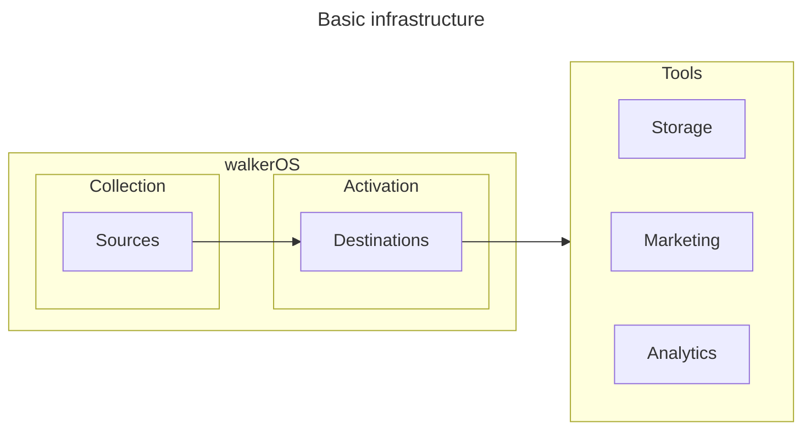

  

# Open-source event data collection and tag management

[Request Feature](https://github.com/elbwalker/walkerOS/issues/new) ·
[Report Bug](https://github.com/elbwalker/walkerOS/issues/new) ·
[Say hello](https://calendly.com/elb-alexander/30min)

  
  
  

# What is walkerOS

walkerOS is a privacy-centric event data collection platform. It offers features
like data capturing,
[consent management](https://www.elbwalker.com/docs/consent_management/overview/),
data integration, and
[tag management](https://www.elbwalker.com/docs/destinations/event_mapping).
Fully configurable as code.

The project started as a web library
called&nbsp;<Link to="/docs/sources/walkerjs/">walker.js</Link> and has evolved
into a complete first-party tracking system.

## Packages Overview

- **Sources** ([docs](https://www.elbwalker.com/docs/sources/),
  [code](./packages/sources/)): For data creation and state management.
- **Destinations** ([docs](https://www.elbwalker.com/docs/destinations/),
  [code](./packages/destinations/)): Initialize, map and share events to
  third-party tools.
- **Utils** ([docs](https://www.elbwalker.com/docs/utils/),
  [code](./packages/utils/)): Enhance data collection with shared utilities.

## Why walkerOS?

- **Sustainability**: Robust infrastructure for continuous data collection, even
  amidst evolving data landscapes.
- **Privacy focus**: Strict privacy-by-design approach, in-build consent
  management</Link> and various data protection features.
- **Complete data ownership**: Full control of your first-party data, no vendor
  lock-in, and control of data processing.
- **Simplified data model**: Intuitive event model that streamlines data
  collection, making analytics straightforward and efficient.
- **Flexible architecture**: Modular design adapting to your specific data needs
  and allows growing step-by-step.

## How walkerOS operates

## Installation

Start collecting data with our
[web](https://github.com/elbwalker/walkerOS/tree/main/packages/web/collector/)
or
[server](https://github.com/elbwalker/walkerOS/tree/main/packages/server/collector/)
source.

## Contributing

⭐️ Help us grow and star us. See our
[Contributing Guidelines](https://www.elbwalker.com/docs/contributing) to get
involved.

## Support

Need help? Start a
[discussion](https://github.com/elbwalker/walkerOS/discussions), or reach out
via [email](mailto:hello@elbwalker.com).

For more insights, visit the
[talks repository](https://github.com/elbwalker/talks).

## License

Licensed under the [MIT License](./LICENSE).
