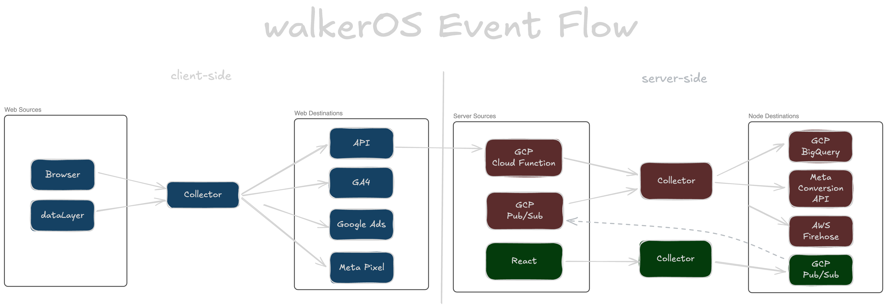

<p align="left">
  <a href="https://www.walkeros.io">
    
  </a>
</p>

# Open-source data collection and tag management

<div align="left">
  <a href="https://github.com/elbwalker/walkerOS/blob/main/LICENSE">
    
  </a>
  <a href="https://www.walkeros.io/docs/">
    
  </a>
  <a href="https://github.com/elbwalker/walkerOS/tree/main/apps/demos/react">
    
  </a>
  <a href="https://storybook.walkeros.io/">
    
  </a>
  <a href="https://www.npmjs.com/package/@walkeros/collector">
    
  </a>
</div>

walkerOS captures, structures, and routes events with built-in support for
consent management — all directly in your code. No fragile UI configs. No
black-box logic. Just **tracking infrastructure** you can **version**, **test**,
and **trust**.

## Why walkerOS?

- **Independence**: Make your data collection independent from single vendor
  specifications to reduce complexity and extra code whenever you add or remove
  a new service. Keep maintenance effort to a minimum.
- **Scalability**: DOM-based, component-level frontend tagging makes tracking
  user behavior declarative, reusable, and easy to maintain.
- **Privacy-first approach**: Built-in consent handling and privacy controls
  help you meet compliance from day one.
- **Type-safe tracking**: Built with TypeScript to catch tracking errors at
  compile time, not in production. Get IDE autocomplete for APIs and destination
  configs, prevent data structure mistakes.

## How it works



## Quick Start

### npm

Install the required packages from npm:

```bash
npm install @walkeros/collector @walkeros/web-source-browser
```

Initialize walkerOS in your project:

```javascript
import { startFlow } from '@walkeros/collector';
import { sourceBrowser } from '@walkeros/web-source-browser';

// Initialize walkerOS
export async function initializeWalker(): Promise<void> {
  const { collector, elb } = await startFlow({
    sources: {
      browser: {
        code: sourceBrowser,
        config: {
          settings: {
            pageview: true,
            session: true,
            elb: 'elb', // Makes elb available as window.elb
          },
        },
      },
    },
    destinations: {
      console: {
        code: {
          type: 'console',
          config: {},
          push: (event) => console.log('Event:', event),
        },
      },
    },
  });

  // Make collector available globally
  window.walker = collector;
}
```

### script tag

For websites without build tools, you can install from a CDN:

```html
<script type="module">
  import { startFlow } from 'https://cdn.jsdelivr.net/npm/@walkeros/collector/dist/index.mjs';
  import { sourceBrowser } from 'https://cdn.jsdelivr.net/npm/@walkeros/web-source-browser/dist/index.mjs';

  const { collector, elb } = await startFlow({
    sources: {
      browser: {
        code: sourceBrowser,
        config: {
          settings: {
            pageview: true,
            session: true,
            elb: 'elb',
          },
        },
      },
    },
    destinations: {
      console: {
        code: {
          type: 'console',
          config: {},
          push: (event) => console.log('Event:', event),
        },
      },
    },
  });

  window.walker = collector;
</script>
```

## Example: React

Here's a quick look at how to integrate walkerOS into a React application.

**1. Create a walker setup file:**

```tsx
import type { Collector, WalkerOS } from '@walkeros/core';
import { startFlow } from '@walkeros/collector';

import { createTagger, sourceBrowser } from '@walkeros/web-source-browser';

// Global type declarations
declare global {
  interface Window {
    elb: WalkerOS.Elb;
    walker: Collector.Instance;
  }
}

export async function initializeWalker(): Promise<void> {
  // Skip initialization if already done
  if (window.walker) return;

  // Create collector with run: false for manual pageview control
  const { collector } = await startFlow({
    run: false,
    consent: { functional: true },
    sources: {
      browser: {
        code: sourceBrowser,
        config: {
          settings: {
            pageview: true,
            session: true,
            elb: 'elb',
          },
        },
      },
    },
    destinations: {
      // Your destinations - add console for testing
      console: {
        push(event, data) {
          console.log('Event:', event, data);
        },
      },
    },
  });

  // Set global window object
  window.walker = collector;
}

// Tagger helper for easy component tagging
const taggerInstance = createTagger();

export function tagger(entity?: string) {
  return taggerInstance(entity);
}
```

**2. Integrate into your App component:**

```tsx
import { Routes, Route, useLocation } from 'react-router-dom';
import { useEffect, useRef } from 'react';
import { initializeWalker } from './walker';

function App() {
  const location = useLocation();
  const hasInitialized = useRef(false);
  const firstRun = useRef(true);

  useEffect(() => {
    // Prevent React StrictMode double execution
    if (!hasInitialized.current) {
      initializeWalker();
      hasInitialized.current = true;
    }
  }, []);

  useEffect(() => {
    // Skip first run to prevent double page views
    if (firstRun.current) {
      firstRun.current = false;
      return;
    }

    window.elb('walker run');
  }, [location]);

  return (
    <div className="min-h-screen bg-gray-50">
      <Routes>
        <Route path="/" element={<Home />} />
        <Route path="/category" element={<Category />} />
        <Route path="/product/:id" element={<Detail />} />
      </Routes>
    </div>
  );
}

export default App;
```

**3. Tag your components:**

```tsx
import { tagger } from '../walker';

function ProductDetail({ productId }: { productId: string }) {
  const product = getProductById(parseInt(productId));

  return (
    <div
      {...tagger()
        .entity('product')
        .action('load', 'view')
        .data('productId', productId)
        .get()}
      className="bg-white rounded-lg shadow p-8"
    >
      <h1
        {...tagger('product').data('name', product.name).get()}
        className="text-3xl font-bold mb-2"
      >
        {product.name}
      </h1>

      <p
        {...tagger('product').data('price', product.price).get()}
        className="text-3xl font-bold text-blue-600"
      >
        €{product.price}
      </p>

      <button
        {...tagger().action('click', 'add').get()}
        className="w-full bg-blue-600 text-white py-3 px-6 rounded-lg"
      >
        Add to Cart
      </button>
    </div>
  );
}
```

## Destinations

Destinations are the endpoints where walkerOS sends your processed events. They
transform standardized walkerOS events into specific formats required by
analytics platforms, marketing tools, and data warehouses.

#### Web Destinations

- **[API](https://www.walkeros.io/docs/destinations/web/api)** - Send events to
  your own endpoints
- **[Google (gtag)](https://www.walkeros.io/docs/destinations/web/gtag/)** -
  GA4, Google Ads, and GTM integration
- **[Meta Pixel](https://www.walkeros.io/docs/destinations/web/meta-pixel)** -
  Facebook and Instagram advertising
- **[Plausible Analytics](https://www.walkeros.io/docs/destinations/web/plausible)** -
  Privacy-focused web analytics
- **[Piwik PRO](https://www.walkeros.io/docs/destinations/web/piwikpro)** -
  Privacy-focused analytics platform

#### Server Destinations

- **[AWS Firehose](https://www.walkeros.io/docs/destinations/server/aws)** -
  Amazon cloud services integration
- **[GCP BigQuery](https://www.walkeros.io/docs/destinations/server/gcp)** - GCP
  services and BigQuery
- **[Meta Conversions API](https://www.walkeros.io/docs/destinations/server/meta-capi)** -
  Server-side Facebook/Instagram tracking

## Contributing

⭐️ Help us grow and star us. See our
[Contributing Guidelines](https://www.walkeros.io/docs/contributing) to get
involved.

## Support

Need help? Start a
[discussion](https://github.com/elbwalker/walkerOS/discussions), or reach out
via [email](mailto:hello@elbwalker.com).

For more insights, visit the
[talks repository](https://github.com/elbwalker/talks).

## License

Licensed under the [MIT License](./LICENSE).
