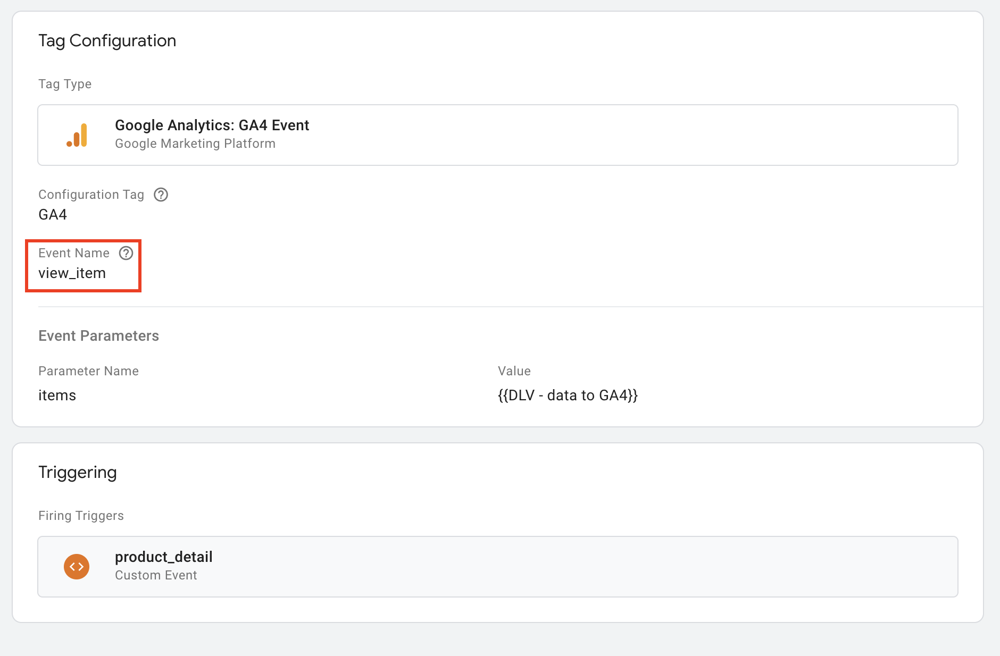
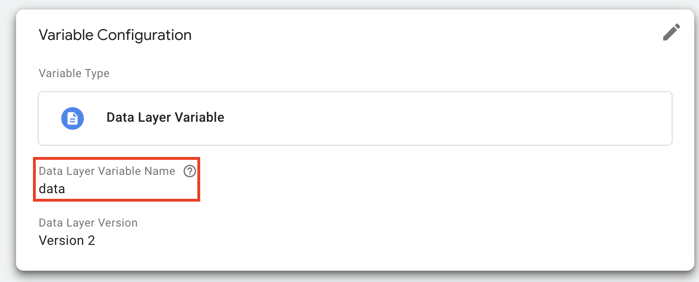
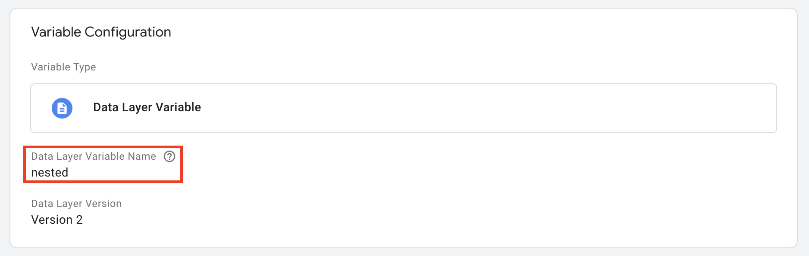
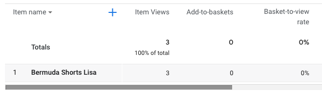
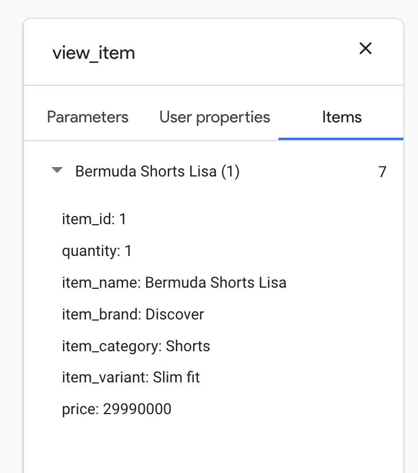

This guide will explain the entire workflow from tagging your HTML with
walker.js, creating tags, triggers and variables in Google Tag Manager (GTM) and
finally viewing the data in Google Analytics 4 (GA4). This example will focus on
the e-commerce event of firing a product view.

{/* truncate */}

To be able to follow along with the guide, a GTM and GA4 setup, as well as basic
knowledge in both applications, are assumed.

## Walker.js implementation

Your site is already tagged? Jump to
[Google Tag Manager](#google-tag-manager-configuration) configuration.

Using walker.js you can track every user interaction without writing a single
line of JavaScript. You just have to add the HTML attributes to your site.

In this guide you will learn how to tag your HTML, configure your tags in GTM
and view the data in GA4 with the exemplary event product view.

### Product view

That's how the implementation could look like:

```html
<div data-elb="product" data-elbaction="load:view" data-elb-product="id:1">
  <p class="name" data-elb-product="name:Bermuda Shorts Lisa">
    Bermuda Shorts Lisa
  </p>
  <span class="producer" data-elb-product="brand:Discover">Discover</span>
  <span class="variant" data-elb-product="variant:Slim fit">Slim fit</span>
  <button data-elbaction="click:remove"></button>
  <div class="category" data-elb-product="category:Shorts">Shorts</div>
  <div class="price" data-elb-product="price:29">€ 29</div>
  <p class="description">...</p>
  <input
    type="text"
    class="qantity"
    value="1"
    name="quantity"
    data-elb-product="quantity:#value"
  />
  <button data-elbaction="click:add">Add to cart</button>
</div>
```

Once a page is loaded by a user all property values from the element as well as
all child elements of the entity container and their parents will be collected.
In the background a dataLayer.push will be generated with the following
structure:

```js
dataLayer.push({
  event: 'product view',
  data: {
    id: 1,
    name: 'Bermuda Shorts Lisa',
    brand: 'Discover',
    variant: 'Slim fit',
    category: 'Shorts',
    price: '29',
    quantity: 1,
  },
});
```

## Google Tag Manager configuration

The Google Tag Manager is used to send the collected product data to GA4.

### Tag

To create the product view tag in GTM, you have to create a new GA4 Event Tag.



The Event Name field of the tag should **always** be set to the correct value.
Mismatches between the given name and the parameter map will lead to the loss of
data. Checkout all
[GA4 events](https://developers.google.com/analytics/devguides/collection/ga4/reference/events).
In this example, we only need the event parameter items given by Google. It is
recommended to use the parameters value and currency if you want to set the
event as a conversion. We will set a custom-created variable as items value,
which we are going to create later in this guide.

### Trigger

You have to ensure to use a trigger on the newly created tag. The trigger has to
fire when the `product view` is pushed into the dataLayer.


The Event name of the trigger should **always** be set to the name of the
entity + the selected trigger (in your HTML tagging).

### Variables

In this case, three Variables have to be created to make sure that the pushed
data is showing how expected in GA4.

#### 1. items (Custom JavaScript)

Use the following code:

```js
function () {
  var productMapping = {{DLV - product.mapping}};
  var data = {{DLV - walker.data}};

  var items = Object.keys(data).reduce(function (props, key) {
    props[productMapping[key]] = data[key];
    return props;
  }, {});
  return [items];
}
```

This function is used to map the data of the pushed dataLayer into the GA4
syntax. The variable `productMapping` and `data` need to be created manually:

#### 2. data (Data Layer variable)

This variable is containing the values of the pushed item



The Data Layer variable name should **always** be set to data. A mismatch will
lead to a loss of data. The name of the variable itself needs to be
&#123;&#123;DLV - walker.data&#125;&#125;. If you want it to have a different
name, it is important to allocate it to the var data in the code snippet.

#### 3. productMapping (custom JavaScript variable)

The `productMapping` variable is used in the mapping function mentioned above.
It is used as _dictionary_ to know how the pushed keys are named in GA4.

```js
function () {
  return {
    id: "item_id",
    name: "item_name",
    affiliation: "affilation",
    coupon: "coupon",
    currency: "currency",
    discount: "discount",
    index: "index",
    brand: "item_brand",
    category: "item_category",
    category2: "item_category2",
    category3: "item_category3",
    category4: "item_category4",
    category5: "item_category5",
    list_id: "item_list_id",
    list_name: "item_list_name",
    variant: "item_variant",
    location_id: "location_id",
    price: "price",
    quantity: "quantity"
  };
}
```

The name of the variable itself needs to be `{{DLV - product.mapping}}`. If you
want it to have a different name, it is important to allocate it to the var

`productMapping` in the code snippet. All keys of the variable have to match the
keys used in the dataLayer.push but are **free to define**. Unused pairs can be
removed. The values on the other hand are predefined GA4 values. Changing them
will lead to a loss of data.

### Pushing multiple products Pushing

multiple products requires small changes to the mapping JavaScript function,
aswell as the Data Layer variable.

`productMapping` stays the same. In this case, three variables have to be
created to make sure that the pushed data is showing how expected in GA4.

#### 1. Custom JavaScript variable with the following code:

```js
function () {
  var productMapping = {{DLV - product.mapping}};
  var nested = {{DLV - walker.nested}};

  return nested.reduce(function (items, entity) {
    var item = Object.keys(entity.data).reduce(function (props, key) {
      props[productMapping[key]] = entity.data[key];
      return props;
    }, {});
    items.push(item);
    return items;
  }, []);
}
```

#### 2. Nested (Data Layer variable)

This variable is containing the values of the pushed item



### Google Analytics 4

If you have enabled
[debug mode](https://support.google.com/analytics/answer/7201382?hl=en), the
fired `view_item` should be visible in the second stream of the view, containing
the pushed item(s). It is now possible to check whether all parameters were
fired correctly.



In the E-commerce reports section, you can see the pushed item in the category
"E-commerce purchases and item views". This can take up to 48 hours.



As you can see, the item was not added to a basket yet. In this case, the next
step would be to implement the `add_to_cart` event. Since we already have a
tagged button on our product detail page, we only need to create a GTM tag
equipped with a trigger. Refering to GA4 docs the add_to_cart event only
requires the items parameter, which we initialized earlier.

Now you could move on with events like `add_to_wishlist`, `add_payment_info`,
`begin_checkout` and so on.

**That's it!** 🥳 With this guide, you created the foundation for your tracking
journey with walker.js & GA4!
