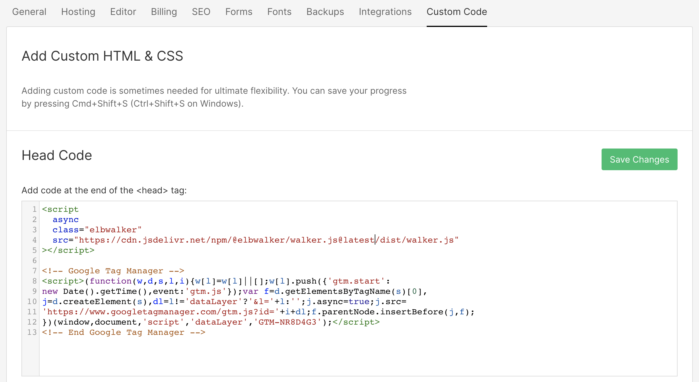

This guide helps you to implement and use walker.js on Webflow sites to further
use them in Google Tag Manager (GTM) 🤓

{/* truncate */}

[Webflow](https://webflow.com/) is a no-code web design tool including content
management and hosting functionality. To be able to follow along with the guide,
a Webflow and a Google Tag Manager setup, as well as basic knowledge of both
these applications, is required.

### Define what you want to measure

First, make a plan of what events you want to measure. Those can be
business-related conversion goals or usage events you want to keep track of.

This example will show how a CTA section on a Webflow page could be tagged. An
event will be fired on a view of the section and for every click on one of the
buttons. We will also add some properties to add information leading to more
meaningful events.

That's what the example looks like:


This is how an exemplary mini-measurement plan could look like:

@TODO TABLE

### Adding scripts to Webflow

It is necessary to add the walker.js script as well as the GTM script to your
Webflow page. This can be done by navigating to **Project Settings {'>'} Custom
Code**. Both scripts belong to the "Head Code". Read more at the
[webflow university](https://university.webflow.com/lesson/custom-code-in-the-head-and-body-tags).

The order of the scripts is not important.

### Copy the walker.js script

Please always use the latest version of the walker.js. The current version can
be found in the [GitHub repository](https://github.com/elbwalker/walkerOS).

```html
<script
  async
  class="elbwalker"
  src="https://cdn.jsdelivr.net/npm/@elbwalker/walker.js@latest/dist/walker.js"
  data-default="true"
></script>
```

### Copy the Google Tag Manager script

Please add your individual container ID to the script. If you don't know where
to find it check out the
[Google documentation](https://support.google.com/tagmanager/answer/6103696).

```js
<script>
(function(w,d,s,l,i){w[l]=w[l]||[];w[l].push({'gtm.start': new Date().getTime(),
event:'gtm.js'});var f=d.getElementsByTagName(s)[0], j=d.createElement(s),
dl=l!='dataLayer'?'&l='+l:'';j.async=true;j.src= 'https://www.googletagmanager.com/gtm.js?id='+i+
dl;f.parentNode.insertBefore(j,f); })(window,document,'script','dataLayer','CONTAINERID');
</script>
```

Your project settings should look somewhat like this now.



### Add data attributes

The next step is to tag your website. In this guide, the CTA section will be
tagged exemplary as mentioned earlier.

Check out our [documentation](/docs/) if you need more info on how the walker.js
works.

### Set globals

Generally speaking, it makes sense to set a page type to separate the occurrence
of the CTA since it is positioned on multiple sites of the webpage. This is
useful to differentiate between the amount of fired CTA events for each site.
Now we can determine the best working sites for the CTA as well as sites where
the section is perhaps not visible or converting at all.

Ideally **globals** are used for this. We can use them to send properties from
our page which don't belong to just one event but all events. They will be
collected once, right before the first event gets fired. What is special about
them is that you can define them anywhere on a page by using the data-elbglobals
attribute. Learn more about globals in our blog post about elbglobals.

What is special about them is that you can define them anywhere on a page by
using the data-elbglobals attribute. Learn more about globals in our blog
[post about globals](/blog/2022/05/13/globals).

**globals** → data-elbglobals = pagetype:home

This is what the tagging via custom attributes in Webflow could look like.


### Set entity and properties

The entity in this example is the CTA section. It is possible to assign
properties to the entity, which will be used to store entity-related
information(e.g. title).

This example uses following attributes:

- **Entity** → `data-elb = "cta"`
- **Action** → `data-elbaction = "visible:view"`
- **Property** → `data-cta = "title:Ready to get started?"`


### Set actions

Actions are used to trigger events of the entity. On the CTA both buttons are
used to trigger a click event. <br /> For better traceability the action of both
buttons will be named after their purpose.

→ "Get started for free" = `data-elbaction="click:start"`


→ "Book a demo" = `data-elbaction="click:book"`


This is how the custom attributes for the buttons should look like:


That's it! 🥳 Setting up basic event tracking on a webflow page with walker.js
takes you **under 15 minutes.**

### dataLayer pushes

The walker generates the events on the fly for you. You don't need to manually
push things into the dataLayer. For better traceability for the GTM experts the
JavaScript object the walker generates will look like this.

Once the CTA is visible to the user:


Once the user clicks on one of the buttons:


