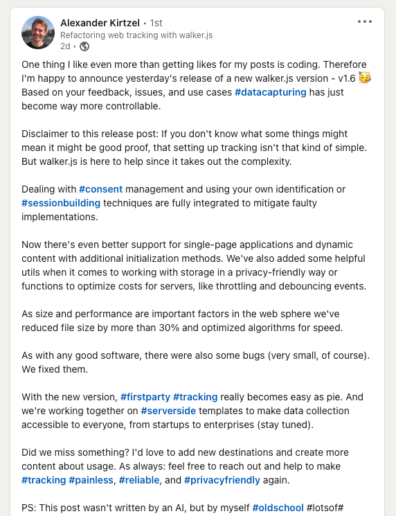

We are starting to regularly post about new releases and features now. Mostly
because
[walker version 1.6](https://github.com/elbwalker/walkerOS/releases/tag/v1.6.0)
absolutely deserves the stage, but it will hopefully also generate even more
feedback to ship more features faster in the future. So let's go, pressure is
on.

{/* truncate */}

Here are a few updates we've been working on over the past few weeks, from
creating a consent mode that works reliably and is easy to handle, to important
performance improvements, to new config options, to an additional scroll trigger
(probably the best one out there 🤞), and even more! Keep reading to get the
latest updates on what we've been shipping 👇



## Painless consent management

Consent Management Platforms (in short CMP) only have one job: Asking for
consent and managing choices. They shouldn't be used for implementations and
initializations. With walker.js you now don't have to mix up those things any
longer. A CMP just has to tell the walker.js about the user's choice and the
task to implement the tools based on the user's consent choice is done.

```js
elb('walker consent', { marketing: false, statistics: true });
```

Dealing with timeouts or non-understandable entanglements is no longer

necessary. Walker.js handles the race conditions and is able to also load
external resources in the best possible way. Read more about
[consent management](https://docs.elbwalker.com/privacy/consent) in the docs.

### Support for single-page-applications and dynamic content

We wanted the walker to fully handle pages with dynamic content, where new
trackable content gets loaded asynchronously. Think of infinite product lists,
where new products are loaded shortly before reaching the end of the list. Since
dynamic reloads are something handled by code, we are now calling a new walker
command after the content was added. A walker init command with the scope as the
second parameter is handling this now.

```js
elb('walker init', document.getElementById('dynamic_content'));
```

Find out more about new
[commands](https://docs.elbwalker.com/getting-started/commands#init) in the docs

### Reduced file size and tests for code quality

Data capturing is the source of all further data processing and it has to work
robustly. We're now monitoring more than 95% of the whole code base to be set up
for many different cases and ensure the data quality we deliver in the future.
We regularly check for the best approaches to process event-tracking and
optimize the algorithms for speed. Minimized computing leads to smooth pages,
where no scripts are blocking or polluting the global scope now. It's key for a
seamless user experience on the web.

The whole package-size was reduced by over 30% and is **below 10kb now.⚡️**

This optimizes page load time and leads to more accurate capturing. We mainly
made this possible by unifying and caching some repeatable operations, proper
tree-shaking, and switching to a modern es module instead of commonjs.

### Helpful utils for smooth setups

We integrated a collection of basic tools to speed up, standardize, and minify
your implementation. You can now use a debounce function to group multiple calls
in a single invocation after a specific wait time.

```js
import { debounce } from '@elbwalker/walker.js';

// debounce(fn, wait=1000)
debounce(console.log)('called');
```

And limit the number of invocations within a delay time.

```js
import { throttle } from '@elbwalker/walker.js';

// throttle(fn, delay=1000)
throttle(console.log)('called');
```

We also added useful storage functions. Use pre-build functions to save time
developing them yourself while enjoying the same functionality. To persist data
on a device there are three common ways to write, read and delete values:
Cookies, localStorage, and sessionStorage. Following a privacy-by-design
approach, our [storage utils](https://docs.elbwalker.com/coding/utils#storage)
have an in-build max-age functionality, to specify the maximum lifetime of a
value. The default is set to 30 minutes. While cookies get deleted automatically
by the browser, this doesn't apply to localStorage and sessionStorage.

Check out the [utils](https://docs.elbwalker.com/coding/utils) in our docs

### Other bug-fixes and improvements

Core:

- Scroll trigger support ([#8](https://github.com/elbwalker/walker.js/issues/8))
- Added walker config command to update e.g. globals
  etc.([#129](https://github.com/elbwalker/walker.js/issues/129))
- Enabled scoped inits with walker init command for e.g. async
  content([#127](https://github.com/elbwalker/walker.js/issues/127))
- Use page entity by default if nothing else set
  ([#122](https://github.com/elbwalker/walker.js/issues/122))
- Added context order ([#81](https://github.com/elbwalker/walker.js/issues/81))
- Bugfix: Support for SSR apps like Svelte
  ([#95](https://github.com/elbwalker/walker.js/issues/95))
- Bugfix: Visible trigger can't handle elements larger than viewport
  ([#123](https://github.com/elbwalker/walker.js/issues/123))

Event Schema:

- Renamed user.hash to user.session
  [(#137)](https://github.com/elbwalker/walker.js/issues/137)
- Added consent and source incl. referrer to event
  ([#132](https://github.com/elbwalker/walker.js/issues/132),[#115](https://github.com/elbwalker/walker.js/issues/115))

As always, we absolutely love to hear your feedback to make walker.js become
better every day.

Check out our [GitHub repo](https://github.com/elbwalker/walkerOS) (and give us
a star if you like what we do), leave us a comment on
[LinkedIn](https://de.linkedin.com/company/elbwalker) or write to us at
[hello@elbwalker.com](mailto:hello@elbwalker.com).

Cheers, from the creators of walker.js 💙
