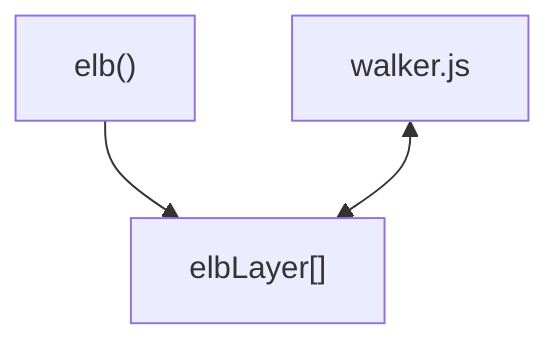

import Link from '@docusaurus/Link';

The walker is designed to support asynchronous communication through the
elbLayer array. With the creation of the Elbwalker() the elbLayer items are
scanned. The walker will process each push. Use the elb helper function as a
handy helper.

```js
// Import
import { elb } from '@elbwalker/walker.js';
window.elb = elb;

// Or define the elb function manually in the browser as an alternative
function elb() {
  (window.elbLayer = window.elbLayer || []).push(arguments);
}
```

The communication works completely asynchronously. The `elb` functions job is to
push events to the `elbLayer`. The `walker.js` will process the stack and each
push.



## Configuration

To configure elbwalker use the walker prefix (like an entity) to call a command.
Setting the general configuration. Almost identical to the settings at the
installation, except for default.

```js
elb('walker config', {
  consent: { functional: true }, // Initial consent states, learn more under consent
  elbLayer: window.elbLayer, // Public elbwalker API for async communication (only prior run)
  globals: {}, // Static attributes added to each event
  pageview: true, // Trigger a page view event by default
  prefix: 'data-elb', // Attributes prefix used by the walker
  user: { id: '', device: '', session: '' }, // Setting the user ids
  tagging: 0, // Current version of the tracking setup
});
```

## Run

A `run` can be seen like a regular page view. It will start the walker.js and
(re-)Initialize the handler, resets counters, clears queues, and updates the
globals. By default a `page view` event is triggered, the tagging is checked for
`load` actions and the `elbLayer` stack is processed.

```js
elb('walker run');
```

## Initialization

(Re-)initializes event listeners on one or multiple target elements. Can be used
for e.g. asynchronously loaded content like newly added products in a category
list or a wizzard.

```js
elb('walker init', element); // or an array of elements
```

## Destinations

To add a destination to the walker.js run the `walker destination` command.
Individual destination configurations can be made by using the
destination.config property.

```js
const destinationLog = { push: console.log }; // Demo destination for console.log
elb('walker destination', destinationLog);

import destinationGTM from '@elbwalker/destination-web-google-gtm';
elb('walker destination', destinationGTM, {
  /* custom config */
});
```

## Consent Management

Those names can be defined arbitrarily, but common groups are functional,
analytics, and marketing. Values are booleans and once a value is set to `true`
it's treated as consent being granted. Previously pushed events during the run
are shared now with destinations as well as new ones.

```js
elb("walker consent", { marketing: true, randomTool: true });
```

Setting a consent state to `false` will immediately stop a destination from
processing any events.

## User

Setting the user ids. There are three levels for user identification. Typically
the user is a company's internal id. In contrast, the device id can be treated
as a value stored in a cookie for a longer time period and the session can be
used for temporary identification.

```js
elb('walker user', { id: 'us3r', device: 'c00k13', session: 's3ss10n' });
```

The new user ids are now added to each event. Make sure to only use hashed or
anonymous ids.

```js
{
  "event": "entity action",
  "user": {
    "id": "us3r",
    "device": "c00k13",
    "hash": "s3ss10n"
  }
  // other properties omitted
}
```

:::info

Learn more about identification and <Link to="/docs/guides/user_stitching">user
stitching</Link> in the guides.

:::

:::caution

We highly recommend only using fully anonymized & arbitrary ids by default and
checking your options with persistent user IDs with your data protection
officer.

:::
