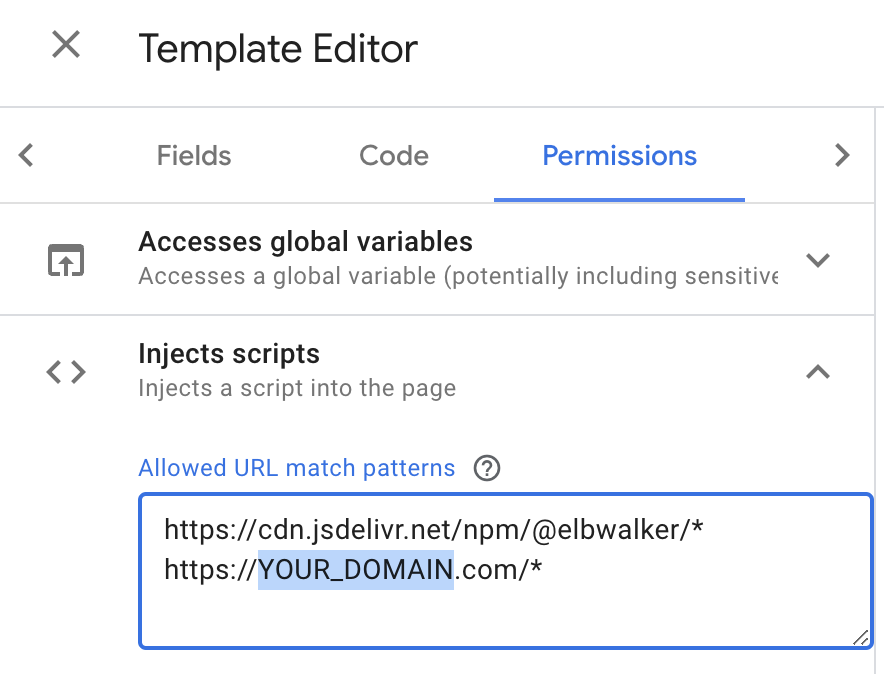
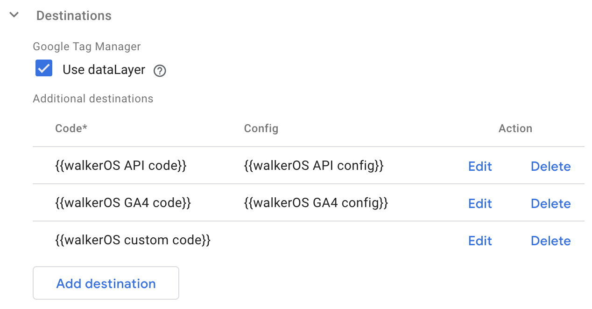
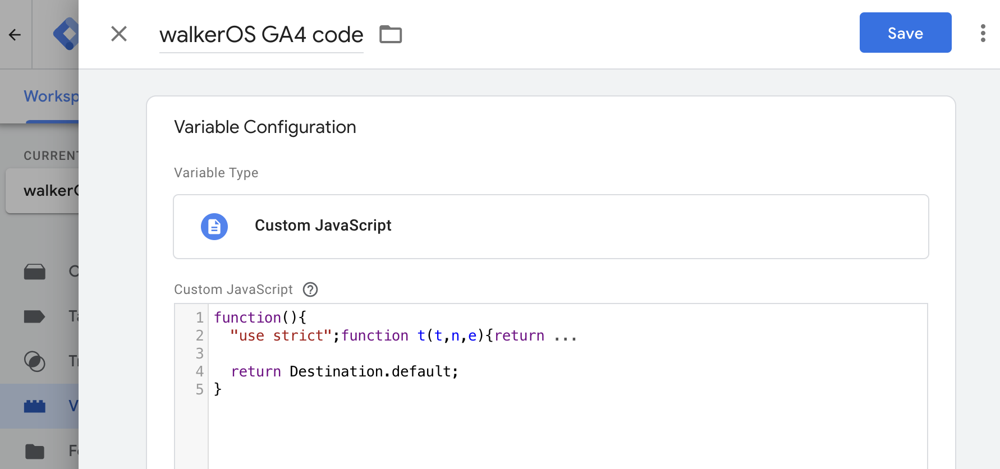
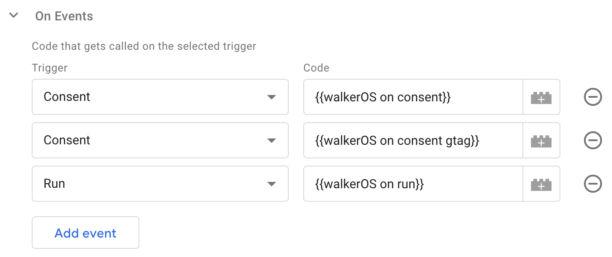
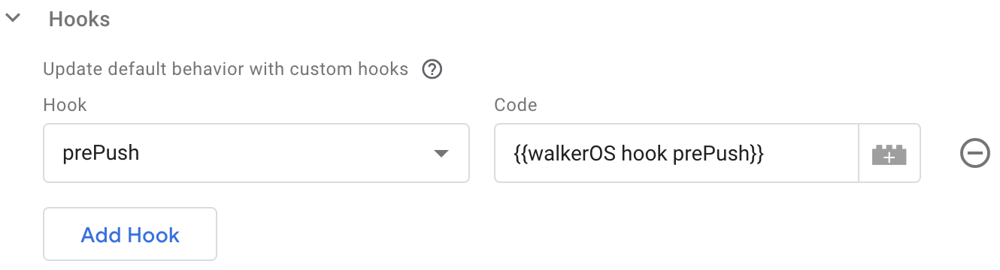

import Link from '@docusaurus/Link';
import Tabs from '@theme/Tabs';
import TabItem from '@theme/TabItem';
import { ButtonCentered } from '/src/components/atoms/buttons';
import { PackageButton } from '/src/components/docs/package-link';

The walkerOS tag template for Google Tag Manager allows an easy integration
of&nbsp;<Link to="/docs/collectors/web-collector/">walker.js</Link> into a website. Once
set up, a single `walkerOS` tag can load walker.js on all pages via GTM.
[Configuration](#options), [destinations](#destinations) and
[on-events](#on-events) can be registered.

:::info

The **walkerOS tag template** is currently in review for the official GTM
Template Gallery. In the meantime, it can be imported manually.

:::

## Setup

### Download

The walkerOS tag template creates a new tag type in Google Tag Manager (GTM)
that allows you to load walker.js on your website easily. Download and import it
once:

<ButtonCentered
  text="Download GTM Tag Template"
  link="https://raw.githubusercontent.com/elbwalker/gtm-walkerOS-tag-template/refs/heads/main/template.tpl"
/>

Click **Download GTM Tag Template** to go to the official source and click the
**Download raw file**.


For installation, follow these steps:

### Step 1

In Google Tag Manager, navigate to **Templates** and click on **New** in the
**Tag Template** section.


### Step 2

    Click on the **three dots** and **Import** option. Select the previously
    downloaded `walkerOS_tag_template.tpl` file and click the **Save** button.
    

### Step 3

    Now you can **create a new Tag** and select the **walkerOS** tag template
    from the **Custom** section. 

## Installation

There are multiple ways to install walker.js on a site using the Google Tag
Manager template.

<Tabs>
  <TabItem value="window" label="Window (recommended)" default>
    The **recommended approach** is to integrate walker.js without fully loading another file. This reduces the total file size and the number of requests for better performance. 
    
    
    
    The Tag template creates an instance using the available factory in the browser window.
    ```js
    import { webCollector } from '@walkerOS/web-collector';
    window.webCollector = webCollector; // Make it globally available
    ```
  </TabItem>
  <TabItem value="self-hosted" label="Self-hosted">
    Save and upload the
    [index.browser.js](https://cdn.jsdelivr.net/npm/@walkerOS/web-collector@latest/dist/index.browser.js)
    to your server for first-party context and minimize requests to external
    domains.

     

:::warning

     The GTM is very restrictive about loading third-party scripts. To load walker.js from a custom domain, update the **Tag Template Permissions** and add `YOUR_DOMAIN` to the **Injects scripts** section.

:::

     

  </TabItem>
<TabItem value="cdn" label="CDN">
Load the script from an external source
(<Link to="https://www.jsdelivr.com/package/npm/@walkerOS/web-collector">jsDelivr</Link>).


:::warning

It's recommended to use a specific version starting from `2.1.0`

:::

:::tip

It's recommended to use the externally hosted version only for demo purposes,
not in production

:::

</TabItem>
</Tabs>

### Mode

There are three modes to start walker.js:

1. **Auto run**: starts automatically when the tag fires.
2. **Require consent**: waits until the consent state is granted before calling
   `walker run`. This uses the `walker on` command internally.
3. **Manual**: won't do anything - it's up to you.

### Names

The default names can be changed to prevent eventual conflicts with other
scripts or existing variables. Ensure the template's **Permissions** are updated
to enable read/write access to the new names.

## Options

### Tagging version

Specifying a tagging `version` helps manage and debug a setup. After changing
the setup, increase the version number.

### User ID

This will set the `user.id` value based on a `variable`. Both device and session
IDs will be set in the Session section or via a custom on-event.

### Globals

Add static `globals` that will be added to every single event.

:::tip

Learn more about
using&nbsp;<Link to="/docs/sources/html-tagging#globals">globals</Link>
within walkerOS

:::

### Logging

Enabling the `preview` adds a destination that logs all events to the console.

### Session

Session detection, user identification, consent management, and race conditions
are closely connected.

:::tip

Learn more about&nbsp;<Link to="/docs/utils/session">how to detect a
session</Link>.

:::

Enabling session detection will use the **sessionWindow** Util as a cookie-less
version to eventually trigger a `session start` event.

Additionally, enabling the **Storage** uses
the&nbsp;<Link to="/docs/utils/session#sessionstorage">**sessionStorage
util**</Link> to persist data and enhance session information and user
identification. As this might require consent, it's possible to add a **Required
consent for storage access**. This uses `elbDeviceId` and `elbSessionId` in the
localStorage.

There is a virtual rule to limit the age to **30 days for the device ID** and
**30 minutes for a session ID**, which updates with each new run.

### Destinations

Destinations are used to send events to other tools. **Use dataLayer** will
automatically send all events to the GTM `dataLayer`.

To add a destination, **Code** is required, while Config is optional.



#### Add destination

    Both **Code** and **Config** are **User-Defined Variables**. A destination code can be some **custom** JavaScript or a **pre-build** version.
    The **config** is a simple object that can be used to configure the destination.

#### User-Defined variable `Code`

<Tabs>
  <TabItem value="code-pre-build" label="Code (Pre-build)" default>
Available&nbsp;<Link to="/docs/destinations">destinations</Link> have a special ES5-build that can be used in the GTM.

1. Copy
   the&nbsp;<Link to="https://cdn.jsdelivr.net/npm/@elbwalker/destination-web-google-gtm@latest/dist/index.es5.js">ES5
   code</Link> and create a new **User-Defined Variable** with the **Custom
   JavaScript** type.
2. Paste the code within the following code block:

```js
function(){
  // Paste the pre-build code here

  return Destination.default;
}
```



:::warning

The `return Destination.default;` is case-sensitive and must be added at the
end.

:::

  </TabItem>
  <TabItem value="code-custom" label="Code (Custom)">
    1. Create new or load a **User-Defined Variable** with the **Custom JavaScript** type and add the following code:

```js
function(){
  return {
    type: 'my-destination',
    init: function(config) {
      console.log('Setting up my destination', config);
    },
    push: function(event, config, mapping) {
      console.log('My destination', event, config, mapping);
    }
  }
}
```

2. Write your own code instead of the `console.log` statements.

  </TabItem>
  </Tabs>

#### User-Defined variable `Config`

Create new or load a **User-Defined Variable** with the **Custom JavaScript**
type and add the following code:

```js
function(){
  return {
    // Common config like
    // loadScript: true,
    custom: {
      // Destination specific config like
      // measurementId: 'G-XXXXXXXXXX'
    }
  }
}
```

This will return a simple config object.

### On Events

On-events, listen to specific **Trigger** to execute **Code**. Use a
**User-Defined Variable** with the **Custom JavaScript** type to create a
**Code** function.



:::tip

Read more about how to use&nbsp;<Link to="/docs/collectors/web-collector/commands#on">on
events</Link> in general.

:::

#### On consent

    Get's called when a `walker consent` command changes a matching state.

    The code has to be an `object` with the **consent state** as the key and the **function** as the value.

```js
function() {
  return {
    functional: console.log,
    marketing: function (instance, consent) {
      console.log('Marketing', consent);
    }
  }
}
```

Only if `functional` or `marketing` stages change, the corresponding function
will be called.

```js
elb('walker consent', { foo: true }); // Won't trigger any function
elb('walker consent', { functional: true, marketing: false }); // Calls both functions
```

Typically, a Consent Management Platform (CMP) will call the `walker consent`
command with the consent state.

#### On run

Get's called with each `walker run` command:

```js
function() {
  return function (instance) {
    console.log('On run');
  }
}
```

### Hooks

Hooks can be used to customize the default behavior of walker.js. A hook can be
called before (<Link to="/docs/utils/hooks#prehookfn"> preHook</Link>) or after
a specific event&nbsp;(<Link to="/docs/utils/hooks#posthookfn">postHook</Link>)
and runs a custom function defined in a **User-Defined Variable**.

:::note

Each call signature is the same as the original function,
see&nbsp;<Link to="/docs/collectors/web-collector/commands#hook">walker commands</Link>.

:::



Create a new **User-Defined Variable** with the **Custom JavaScript** type and
return the function within a js-code block:

```js
// Code for the preHook function
function () {
  return function(params, event, data, options, context, nested) {
    /// custom code
  }
}
```

:::tip

Learn more about the individual
&nbsp;<Link to="/docs/collectors/web-collector/commands#function-signatures">function
signatures</Link>.

:::

:::info

If you need professional support with your walkerOS implementation, check out
our&nbsp;<Link to="/services">services</Link>.

:::
