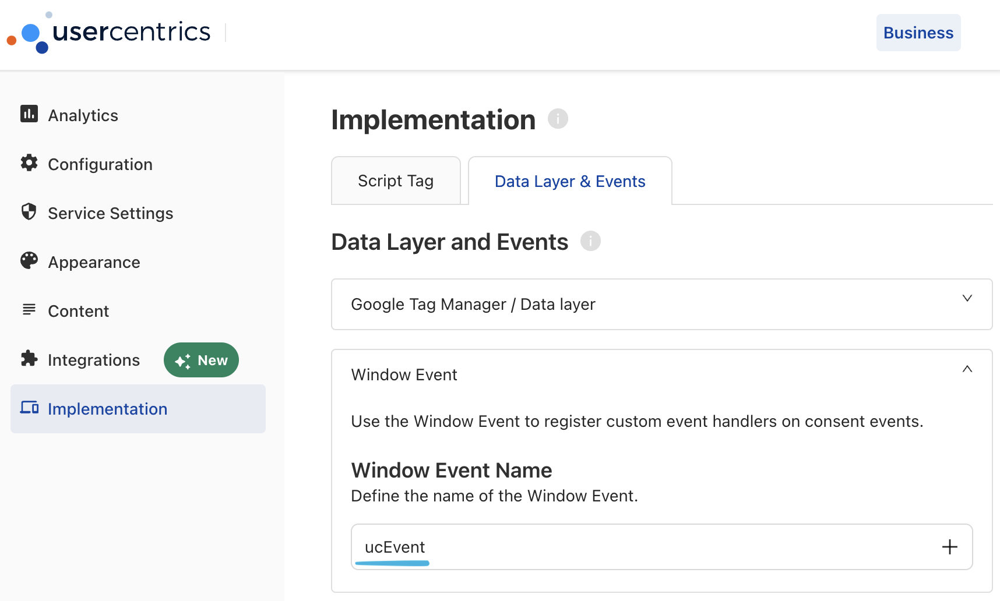

import Link from '@docusaurus/Link';

Usercentrics supports an
[implementation via DataLayer & Events](https://docs.usercentrics.com/#/v2-events?id=usage-as-window-event).
Adding a **Window Event Name** (like `ucEvent`) to will dispatch a users consent
choice:



## Event listener

The following code will listen for the `ucEvent`, parse the consent state and
eventually call the `walker consent` command:

```js
window.addEventListener('ucEvent', function (event) {
  function ucStates(e) {
    if (e.event != 'consent_status') return;
    // if (e.type != 'explicit') return; // Process only explicit consent

    var cat = 'ucCategory';
    if (Object.values(e[cat]).every((val) => typeof val === 'boolean'))
      return e[cat]; // Choice by group

    // Individual choice
    const obj = {};

    // Services
    for (const key in e) {
      if (!['action', 'event', 'type', cat].includes(key)) {
        obj[key.toLowerCase().replace(/ /g, '_')] = e[key];
      }
    }

    // Groups
    for (const key in e[cat]) {
      if (typeof e[cat][key] === 'boolean') obj[key] = e[cat][key];
    }

    return obj;
  }

  const state = ucStates(event.detail);
  if (state) elb('walker consent', state); // Update walker.js consent state
});
```

Optionally uncomment the `e.type !== 'explicit'` check to process only
explicitly given content. This will prevent walker.js from starting
unintentionally or running eventually running twice.

Ensure the [elb](/docs/sources/walkerjs/commands#elb) function is available.

:::info

If you need professional support with your walkerOS implementation, check out
our&nbsp;<Link to="/services">services</Link>.

:::
