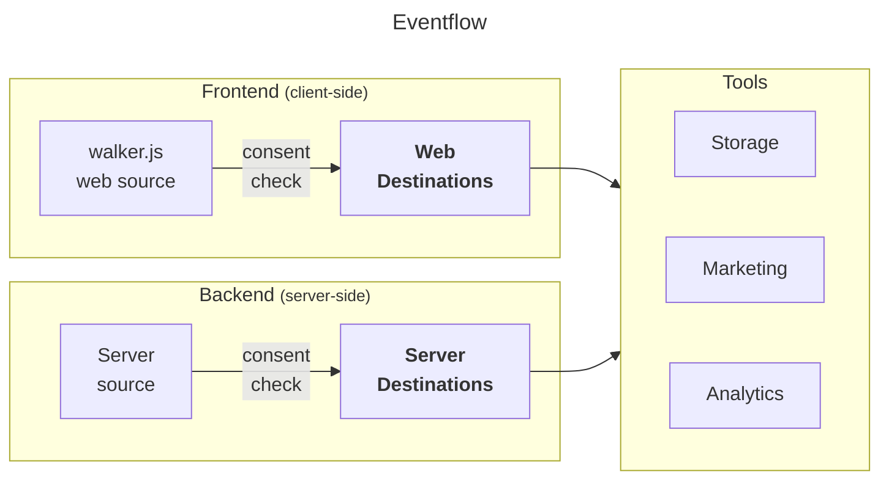

import Link from '@docusaurus/Link';

WalkerOS is built **vendor-agnostically**.
While&nbsp;<Link to="/docs/sources">sources</Link> create events, destinations
are built to manage how events are processed and sent to various **analytics**,
**marketing** or data **storage** tools.

Destinations ensure that data captured from your website or application is
best-organized to easily get integrated with different tools if proper consent
was granted. This helps maintaining data quality and simplifying the setup of
new tools.

## How it works

Destinations are added to a source
(see&nbsp;<Link to="/docs/collectors/web-collector/commands#destination">walker.js</Link>
or&nbsp;<Link to="/docs/collectors/server-collector/commands#destination">server</Link>).
Before receiving events from the source, the proper consent states are checked
each time automatically. Destinations receive events through the `push`
interface. Each destination can have its own configuration, which is set up in
the [`config`](/docs/destinations/event_mapping#example) object. This
configuration includes general settings for the destination and individual event
settings. The optional `init` function in a destination gets called before
actually pushing events. This function must return `true` upon successful
initialization for the events to be processed.

## Categories

There are two types of destinations within walkerOS that destinations are
categorized in: **web** and **server**.

### Web

Like&nbsp;<Link to="/docs/collectors/web-collector">walker.js</Link>, web
destinations run in the **browser** directly. Their purpose is to initialize,
map event data to the vendors' requirements, and send them.

- <Link to="/docs/destinations/web/api">API</Link>
- <Link to="/docs/destinations/web/google_ads">Google Ads</Link>
- <Link to="/docs/destinations/web/ga4">Google Analytics 4</Link>
- <Link to="/docs/destinations/web/gtm">Google Tag Manager</Link>
- <Link to="/docs/destinations/web/meta">Meta Pixel</Link>
- <Link to="/docs/destinations/web/piwikpro">Piwik PRO</Link>
- <Link to="/docs/destinations/web/plausible">Plausible Analytics</Link>

### Server

Server destinations offer a flexible and efficient way to handle your
**server-side** event data. Whether you're sending data to a cloud-based data
warehouse or to a custom API, they make it easy to configure, initialize, and
push your events securely.

- <Link to="/docs/destinations/server/aws">AWS</Link>
- <Link to="/docs/destinations/server/gcp">BigQuery</Link>
- <Link to="/docs/destinations/server/meta">Meta Conversion API</Link>

:::info

If you can't find a destination, you
can&nbsp;<Link to="https://github.com/elbwalker/walkerOS/issues/new?assignees=&labels=&template=feature_request.md&title=">request
it</Link>.

:::

:::info

If you need professional support with your walkerOS implementation, check out
our&nbsp;<Link to="/services">services</Link>.

:::
