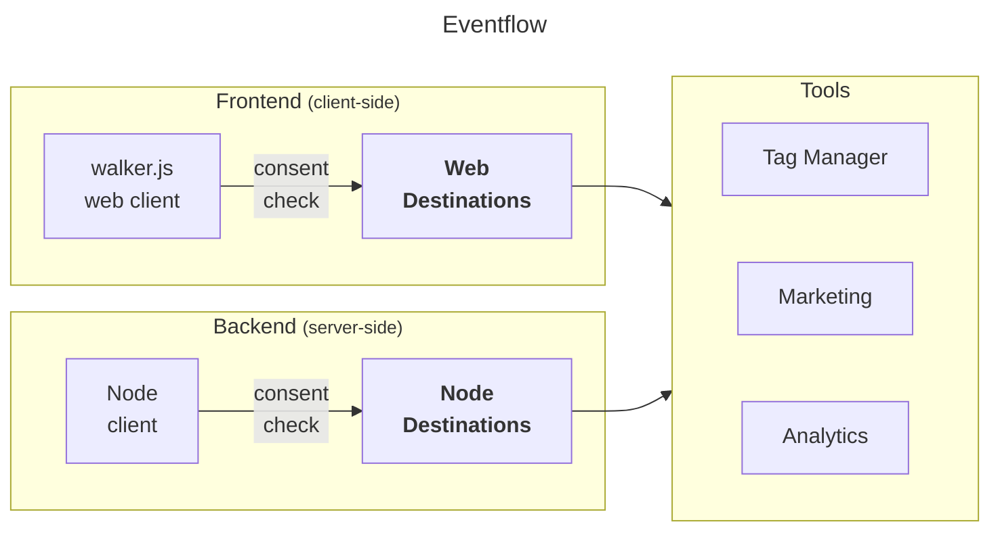

import Link from '@docusaurus/Link';

WalkerOS is meant to be **vendor-agnostic**. While sources create events,
destinations are used to manage how events are processed and sent to various
analytics or data storage tools. The purpose of using destinations in walkerOS
is to ensure that data captured from your website or application is
best-organized to easily integrated with different tools if proper consent was
granted. This helps in maintaining data quality and simplifying the setup of new
tools by simply mapping the events to the desired format.

:::info

Destinations initialize and process events **only if a user granted consent**.

:::

## How to use

Destinations are added to a client
(see&nbsp;<Link to="/docs/sources/walkerjs/commands#destinations">web</Link>
or&nbsp;<Link to="/docs/sources/node/commands#destinations">node</Link>). Before
receiving events from the client, the proper consent states are checked each
time automatically. Destinations receive events through the [`push`](#push)
interface. Each destination can have its own configuration, which is set up in
the [`config`](#configuration) object. This configuration includes general
settings for the destination and individual event settings. The optional
[`init`](#init) function in a destination gets called before actually pushing
events. This function must return true upon successful initialization for the
events to be processed.



## Configuration

The configuration of a destination is set up in the `config`. All properties are
optional. A complete destination configuration might look like this:

```js
{
  id: "demo",
  custom: { foo: "bar" },
  consent: { demo: true },
  init: false,
  loadScript: false,
  mapping: {
    // Read more in the mapping section
    page: {
      view: { name: "pageview" },
    },
    "*": {
      visible: { batch: 2000 },
    },
  },
  policy: {
    'data.gclid': { consent: { marketing: true } },
  },
  queue: true,
  verbose: false,
  onError: (error) => console.error("demo error", error),
  onLog: (message) => console.log("demo log", message),
  on: {
    // Client-related on-events
    consent: [{ marketing: console.log }],
    ready: [console.log],
    run: [console.log],
    session: [console.log],
  },
};

```

Overview of all properties:

| Property       | Value     | Description                                                                                                                              |
| -------------- | --------- | ---------------------------------------------------------------------------------------------------------------------------------------- |
| **id**         | string    | A unique key for the destination                                                                                                         |
| **consent**    | object    | Required consent states to init and push events                                                                                          |
| **custom**     | any       | Used for a destinations individual settings                                                                                              |
| **init**       | boolean   | If the destination has been initialized by calling the init method                                                                       |
| **loadScript** | boolean   | If an additional script to work should be loaded                                                                                         |
| **mapping**    | object    | Configuration how to transform events (see&nbsp;<Link to="/docs/destinations/mapping">Mapping</Link>)                                    |
| **policy**     | boolean   | Enriches, validates, and redacts properties from the event (see&nbsp;<Link to="/docs/utils/mapping#getmappingvalue">MappingValue</Link>) |
| **queue**      | boolean   | Disable processing of previously pushed events                                                                                           |
| **verbose**    | boolean   | Enable verbose logging                                                                                                                   |
| **onError**    | function  | Custom error handler                                                                                                                     |
| **onLog**      | function  | Custom log handler                                                                                                                       |
| **on**         | On.Config | Rules for on-functions that gets triggered on specific events                                                                            |

Call `elb('walker destination', { push: console.log }, config);` to add the
destination to a client. The destination will log all events straight to the
console. Edit a destinations configuration at runtime by accessing
`walkerjs.destinations.<id>`.

> To grant required consent call `elb('walker consent', { demo: true });`.

## Methods

A client communicates with a destination through the methods. It's also the
sources job to check for proper consent, calling the `init` method or batching
events. The only required method is `push` to send events to the destination.

### init

The `init` method is optional and gets called before pushing events. It's used
to eventually load additional scripts or set up the environment. To interrupt
further processing, the method must return `false`.

The walker.js checks the `config.init` value to see if a destination has been
initialized, or not. This way you can add a destination that has already been
initialized.

```js
// Optional init function
const init = (config) => {
  if (config.verbose) config.onLog(config.custom.foo);
  config.custom.count = 0;
};
```

### push

The `push` method gets called to send events to the destination, along with the
`config` and eventually matching `mapping`.

```js
// push function
const push = (event, config, mapping) => {
  config.custom.count++;
  event.data.count = config.custom.count;
  console.log('demo push', { event, config, mapping });
};

// elb("page view");
// Output with the mapping above
// demo log bar
// demo push { event: { data: { count: 1 }, event: 'pageview' }, config: { ... }, mapping: { ... } }
```

### pushBatch

The `pushBatch` method is optional and gets called if the event `mapping` is
configured with a `batch` number to bundle multiple events before sending them
to the destination.

```js
const pushBatch = (batch, config, instance) => {
  console.log('demo pushBatch', { batch, config });
};
```

The `batch` is an object with the `key` of the used mapping, the `events` array
and the `mapping` object itself.

```js
// Configuring a destinations mapping with
const mapping = {
  '*': {
    visible: { batch: 2000 },
  },
};

// Calling a matching event two times
elb('product visible');
elb('promotion visible');

// The destinations pushBatch receives the following batch after 2 seconds
batch = {
  key: '* visible',
  events: [{ event: 'product visible' }, { event: 'promotion visible' }],
  mapping: { batch: 2000 },
};
```

### on

The `on` method is used to set up rules for on-functions that get triggered by
the client (individually for walker.js and node).

```js
const on = {
  consent: [{ marketing: console.log }],
  ready: [console.log],
  run: [console.log],
  session: [console.log], // walker.js only
};
```

Once a client triggers an event, the destinations `on` method gets called.
Replace the `console.log` with your custom function.

## Available Destinations

import DocCardList from '@theme/DocCardList';

<DocCardList />
