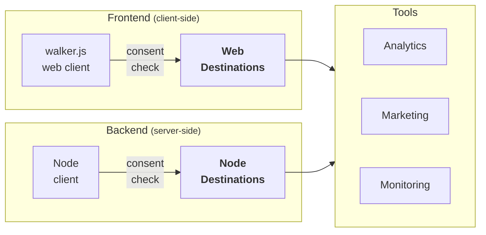

import Link from '@docusaurus/Link';

# Destinations

while clients create events, destinations are used to manage how events are
processed and sent to various analytics or data storage tools. The purpose of
using destinations in walkerOS is to ensure that data captured from your website
or application is best-organized to easily integrated with different tools if
proper consent was granted. This helps in maintaining data quality and
simplifying the setup of new tools by simply mapping the events to the desired
format.

:::info

Destinations initialize or process events **only if a user granted consent**.

:::

## How to use

Destinations are added to a client
(see&nbsp;<Link to="../clients/walkerjs/commands#destination">web</Link>
or&nbsp;<Link to="../clients/node#adding-destinations">node</Link>). Before
receiving events from the client, the proper consent states are checked each
time automatically. Destinations receive events through the [`push`](#push)
interface. Each destination can have its own configuration, which is set up in
the [`config`](#configuration) object. This configuration includes general
settings for the destination and individual event settings. The optional
[`init`](#init) function in a destination gets called before actually pushing
events. This function must return true upon successful initialization for the
events to be processed.



## Configuration

The configuration of a destination is set up in the `config` object. It might be
slightly different for each client. All properties are optional.

| Property       | Value    | Description                                                        |
| -------------- | -------- | ------------------------------------------------------------------ |
| **id**         | string   | A unique key for the destination                                   |
| **consent**    | object   | Required consent states to init and push events                    |
| **custom**     | any      | Arbitrary but protected configurations for custom enhancements     |
| **init**       | boolean  | If the destination has been initialized by calling the init method |
| **loadScript** | boolean  | If an additional script to work should be loaded                   |
| **mapping**    | object   | A map to handle events individually                                |
| **meta**       | object   | Additional meta information about the destination                  |
| **queue**      | array    | Disable processing of previously pushed events                     |
| **verbose**    | boolean  | Enable verbose logging                                             |
| **onError**    | function | Custom error handler                                               |
| **onLog**      | function | Custom log handler                                                 |

A complete destination configuration might look like this:

```js
const config = {
  id: 'demo',
  custom: { foo: 'bar' },
  consent: { demo: true },
  init: false,
  loadScript: false,
  mapping: {
    // Read more in the mapping section
    page: { view: { name: 'pageview' } },
  },
  meta: { name: 'Demo', version: '1.0.0' },
  queue: [],
  verbose: false,
  onError: (error) => console.error('demo error', error),
  onLog: (message) => console.log('demo log', message),
};
```

Call `elb('walker destination', { push: console.log }, config);` to add the
destination to a client. The destination will log all events straight to the
console. Edit a destinations configuration at runtime by accessing
`<client>.config.destinations.<id>`.

To grant required consent call `elb('walker consent', { demo: true });`.

## Mapping

There are common rules for destinations like the renaming of the event name or
the basic rules how to set up the mapping, based on entities and actions
specifically. A `*` can be used to match all entities or actions and set up
common rules. Each destination requires specific settings which can be
configured in the `custom` section of the mapping.

```js
const mapping = {
  entity: { action: {} }, // Basic sctructure
  page: {
    view: { name: 'pageview' }, // Rename the event name
    scroll: { ignore: true }, // Ignore all other page actions
    click: { custom: { language: 'globals.language' } }, // Custom settings
  },
  // Set custom properties
  order: { complete: { name: 'purchase' } },
  '*': { '*': {} }, // Process all other non-listed events
};
```

Both `name` and `ignore` are standardized options to either rename the event or
ignore it completely. The `custom` object can be used to set up custom
properties for the event.

If a mapping is set up, only the events listed will be processed. To also
process non-listed events, add the `{'*': {'*': {}}}` to the mapping. Make sure
to not list duplicate keys in the mapping.

:::info

Use <Link to="../utils/hooks">Utils/Hooks</Link> to modify events before
processing.

:::

## Methods

### push

```js
// push function
const push = (event, config, mapping) => {
  config.custom.count++;
  event.data.count = config.custom.count;
  console.log('demo push', { event, config, mapping });
};

// Output:
// demo log bar
// demo push { event: { data: { count: 1 }, event: 'pageview' }, config: { ... }, mapping: { ... } }
```

### init

```js
// Optional init function
const init = (config) => {
  if (config.verbose) config.onLog(config.custom.foo);
  config.custom.count = 0;
  return true; // no error occured, ready to work properly
};
```

### setup

import DocCardList from '@theme/DocCardList';

<DocCardList />
