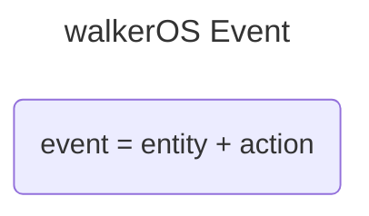

# Event model

The walkerOS event model was created to support analytics, marketing, privacy
and data science needs.

## Entity-action approach

The Entity-Action approach is central to the walkerOS event model: a
framework for capturing user interactions in a structured, flexible way. Two
primary components define each event:

* the **'entity'** (what is involved within an interaction) and
* the **'action'** (what is done with the entity)

walkerOS event definitions are fully flexible: build your tracking around
your business logic, instead of forcing your business logic into analytics
specs.

Tracking terms should be plain enough that everyone involved understands them
immediately. Only when everyone understands what is being measured are there
fewer misunderstandings, higher data quality, and more actionable data across
the organization.

## Event structure

A walkerOS event consists of three components:

* a **trigger** (e.g. load)
* an **entity** (e.g. page)
* an **action** (e.g. view)

Here's an example of the structure and components of a walkerOS event. Keys are
static, their content can be defined dynamically with different value types.

<CodeSnippet
  code={`
{
  name: 'promotion view', // Name as a combination of entity and action
  data: {
    // Arbitrary properties related to the entity
    name: 'Setting up tracking easily',
    interactive: false,
  },
  context: {
    // Provides additional information about the state during the event
    stage: ['learning', 1], // A logical funnel stage
    test: ['engagement', 0], // Key, [value, order]
  },
  globals: {
    // General properties that apply to every event
    language: 'en',
  },
  custom: {}, // Additional space for individual setups
  user: {
    // Contains user identifiers for different identification levels
    // Require consent and set manually for sessions building and cross-device
    id: 'us3r1d',
    device: 'c00k131d',
    session: 's3ss10n1d',
    // More user-related properties, see below
  },
  nested: [
    // All nested entities within the main entity
    { entity: 'github', data: { repo: 'walkerOS' } },
  ],
  consent: {
    // Status of the granted consent state(s)
    functional: true,
    marketing: true
  },
  id: '0123456789abcdef', // W3C Trace Context span_id (16 lowercase hex chars)
  trigger: 'visible', // Name of the trigger that fired
  entity: 'promotion', // The entity name involved in the event
  action: 'view', // The specific action performed on the entity
  timestamp: 1647261462000, // Time when the event fired
  timing: 3.14, // Seconds from the start of the run until the event fired
  source: {
    // Details about the origin of the event
    type: 'browser', // Source kind (e.g. browser, dataLayer, express)
    platform: 'web', // Runtime platform (web or server)
    schema: '4', // walkerOS event schema version
    trace: '0123456789abcdef0123456789abcdef', // run-scoped W3C trace_id (groups all events of a run)
    count: 1, // emission sequence within the run
    release: { web: '3' }, // per-flow config release map, accumulates web to server
    url: 'https://github.com/elbwalker/walkerOS', // Page or request URL
    referrer: 'https://www.walkeros.io/', // Referrer URL
  },
}

`}
  language="javascript"
/>

**Event names** are a combination of the entities involved (*promotion*) and the
action performed (*view*).

The structure remains consistent across all interactions, whether the event e.g.
is a `page view`, `session start`, `product visible`, or `order complete`.

### Data properties

Data properties describe the entity in more detail. Depending on the entity
(e.g. *product*, *order*, *content*) they can vary and provide specific insights
relevant to the interaction.

### Context

Context is the state or environment in which the event was
triggered. It could be as simple as a page position or as complex as the logical
stage in a user journey, like a shopping journey from inspiration to checkout
stage.

### Globals

Globals describe the overall state influencing events or user behavior.
These might include the theme used, page type for web, or cart value.

### Custom

A reserved space for individual setups to comply with the defined structure, but
also to support custom requirements.

### User

There are recommended identifiers used for stitching user journeys together:
`id`, `device`, and `session`.

This enables cross-device tracking or linking sessions for a cohesive user
journey. On a server-side setup, the
[fingerprint transformer](/docs/transformers/fingerprint) can add a `hash` value
(written to `user.hash` by default). Any other user-related information can
also be added. A few values are recommended:

<CodeSnippet
  code={`interface User extends Properties {
// IDs
id?: string; // User ID
device?: string; // Typically a cookie or local storage ID
session?: string; // Session ID
hash?: string; // Hashed identifier, e.g. from the fingerprint transformer
// User related
address?: string; // Postal address
email?: string; // Email address
phone?: string; // Phone number
userAgent?: string; // Full user agent string
browser?: string; // Browser name
browserVersion?: string; // Browser version
deviceType?: string; // Type of device like, mobile, desktop, tablet
language?: string; // User's language settings
country?: string; // Country code
region?: string; // Region code
city?: string; // City name
zip?: string; // Postal code
timezone?: string; // Timezone
os?: string; // Operating system
osVersion?: string; // Operating system version
screenSize?: string; // Screen size
ip?: string; // IP address
internal?: boolean; // Internal user flag
}`}
  language="typescript"
/>

### Consent

<Link to="/docs/guides/consent/">Consent</Link> captures the permissions
granted by the user, needed for subsequent data processing and helpful for
complying with privacy regulations.

### Source

The source describes the origin of the event. `type` identifies the source
kind (e.g. `browser`, `dataLayer`, `express`), `platform` distinguishes the
runtime (`web` or `server`), `schema` records the walkerOS event schema
version, and `url` plus `referrer` capture page-context for basic journey
attribution.

`trace` is a [W3C Trace Context](https://www.w3.org/TR/trace-context/)
`trace_id` (32 lowercase hex characters) minted on each run and shared by every
event of that run, and `count` is the event's sequence within the run. The
event `id` is a W3C `span_id` (16 lowercase hex characters) generated per
event. The collector sets `trace`, `count`, and `id` only when they are absent,
so an event forwarded from web to server keeps its original values.

## Strengths

### Structured flexibility

walkerOS is the single source of truth of data collection. The event model
ensures comparability, manageability, and minimizes implementation efforts,
preventing data leaks or inaccuracies.

### Vendor-agnostic

The event model is designed to be resilient, allowing adaptability to future
legal or internal requirements without vendor lock-in.

### Industry-agnostic

The model supports use cases beyond e-commerce, including media, (B2B) SaaS,
and more.

## How events get transformed

walkerOS events use a **vendor-agnostic format**. When sending to destinations like GA4, BigQuery, or your API, events are transformed using **mapping**.

<FlowMap
  sources={{ default: { label: 'walkerOS', text: 'Event' } }}
  collector={{ label: 'Mapping' }}
  destinations={{ default: { label: 'Destination', text: 'Format' } }}
/>

For example, a `product add` event becomes `add_to_cart` for GA4, while the same event might be stored with different field names in BigQuery.

Mapping lets you:
- Rename events for each destination
- Restructure data properties
- Apply conditional transformations
- Process nested entities (like products in an order)

[**Learn more about mapping →**](/docs/mapping)
