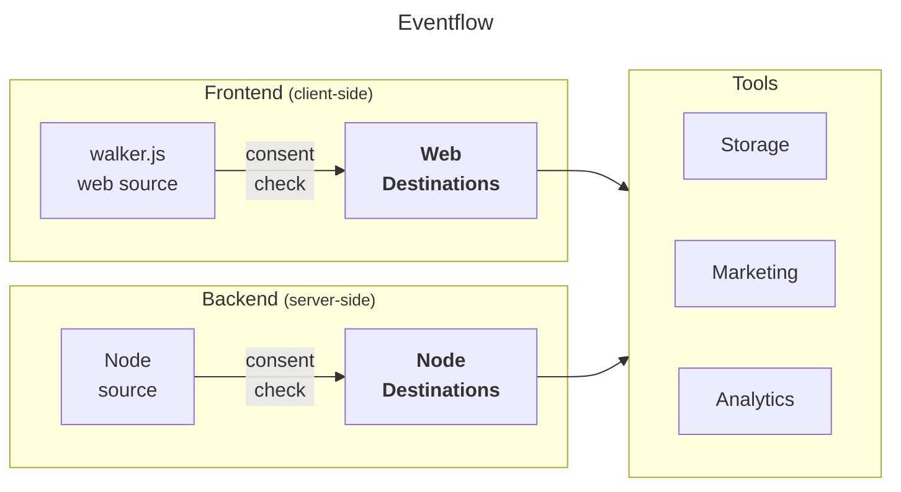

import Link from '@docusaurus/Link';

WalkerOS is built **vendor-agnostically**.
While&nbsp;<Link to="/docs/sources">sources</Link> create events, destinations
are built to manage how events are processed and sent to various **analytics**,
**marketing** or data **storage** tools.

Destinations ensure that data captured from your website or application is
best-organized to easily get integrated with different tools if proper consent
was granted. This helps maintaining data quality and simplifying the setup of
new tools.

## How it works

Destinations are added to a source
(see&nbsp;<Link to="/docs/sources/walkerjs/commands#destination">walker.js</Link>
or&nbsp;<Link to="/docs/sources/node/commands#destination">node</Link>). Before
receiving events from the source, the proper consent states are checked each
time automatically. Destinations receive events through the
[`push`](/docs/destinations/configuration#push) interface. Each destination can
have its own configuration, which is set up in the
[`config`](/docs/destinations/configuration#example) object. This configuration
includes general settings for the destination and individual event settings. The
optional [`init`](/docs/destinations/configuration#init) function in a
destination gets called before actually pushing events. This function must
return `true` upon successful initialization for the events to be processed.

## Categories

There are two types of destinations within walkerSO that destinations are
categorized in: **web** and **node**.

### Web

Like&nbsp;<Link to="/docs/sources/walkerjs">walker.js</Link>, web destinations
run in the **browser** directly. Their purpose is to initialize, map event data
to the vendors' requirements, and send them.

- <Link to="/docs/destinations/api">API</Link>
- <Link to="/docs/destinations/google-ads">Google Ads</Link>
- <Link to="/docs/destinations/google-ga4">Google Analytics 4</Link>
- <Link to="/docs/destinations/google-gtm">Google Tag Manager</Link>
- <Link to="/docs/destinations/meta-pixel">Meta Pixel</Link>
- <Link to="/docs/destinations/piwikpro">Piwik PRO</Link>
- <Link to="/docs/destinations/plausible">Plausible Analytics</Link>

### Node

Node destinations offer a flexible and efficient way to handle your
**server-side** event data. Whether you're sending data to a cloud-based data
warehouse or to a custom API, they make it easy to configure, initialize, and
push your events securely.

- <Link to="/docs/destinations/aws">AWS</Link>
- <Link to="/docs/destinations/bigquery">BigQuery</Link>
- <Link to="/docs/destinations/meta">Meta Conversion API</Link>

:::info

If you can't find a destination, you
can&nbsp;<Link to="https://github.com/elbwalker/walkerOS/issues/new?assignees=&labels=&template=feature_request.md&title=">request
it</Link>.

:::

:::info

If you need professional support with your walkerOS implementation, check out
our&nbsp;<Link to="/services">services</Link>.

:::
