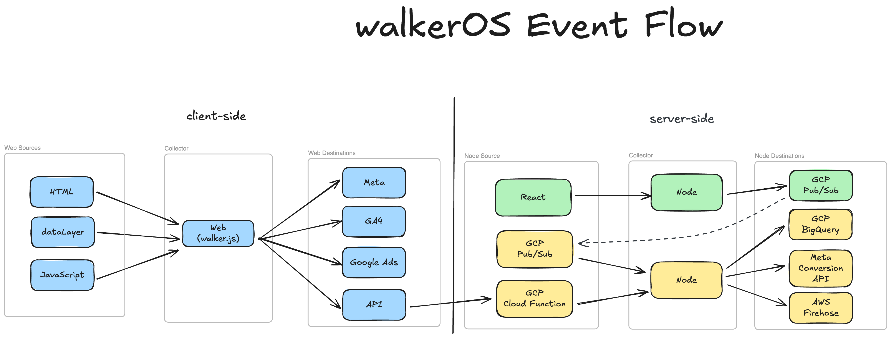

import Link from '@docusaurus/Link';

# Welcome to walkerOS

walkerOS is an **event data collection and tag management solution as code**. It
captures, structures, queues, and routes events with built-in support
for&nbsp;<Link to="/docs/consent_management/overview">consent management</Link>
— all directly in your code. No fragile UI configs. No black-box logic. Just
tracking you can **version, test, and trust**.

The project started as the lightweight web tracking
library&nbsp;<Link to="/docs/collectors/web-collector/">walker.js</Link>, and
has evolved into a **complete first-party tracking system** for modern teams and
the modern web.

## Why walkerOS?

- **Full data ownership**: Your data stays yours. No vendor lock-in, no
  third-party dependencies, complete control over how data is captured,
  processed and shared.
- **Scalable tagging**: DOM-based, component-level frontend tagging makes
  tracking declarative, reusable, and easy to maintain.
- **Privacy-first by design**: Built-in consent handling and privacy controls
  help you meet compliance from day one.
- **Tag management as code**: Replace complex UIs with clean, version-controlled
  tracking logic.

## walkerOS event flow

:::info

If you need professional support with your walkerOS implementation, check out
our&nbsp;<Link to="/services">services</Link>.

:::
