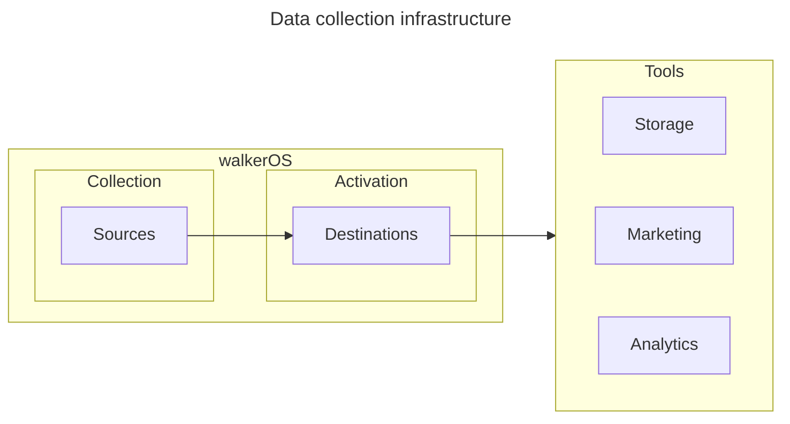
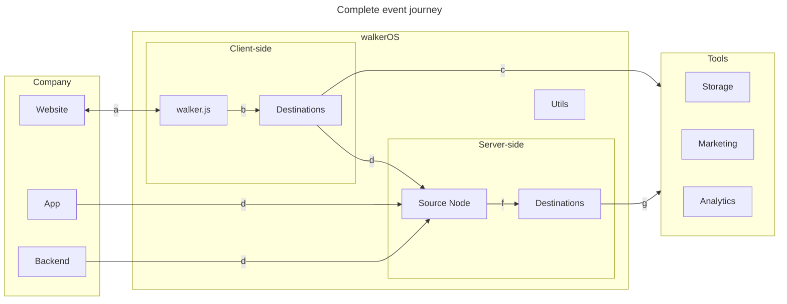

import Link from '@docusaurus/Link';

# Welcome to walkerOS

walkerOS is a unified, privacy-centric data collection platform that creates a
single source of truth for data, marketing and product teams. It offers features
like&nbsp;<Link to="/docs/sources/overview">data
capturing</Link>,&nbsp;<Link to="/docs/consent_management/overview">consent
management</Link>,&nbsp;<Link to="/docs/destinations/overview">data
integration</Link>, and&nbsp;<Link to="/docs/destinations/event_mapping">tag
management</Link> creating reliable first-party data with full data ownership.

## Why walkerOS?

- **Sustainability**: A robust infrastructure for continuous data collection,
  even amidst evolving data landscapes.
- **Privacy focus**: Emphasizing user privacy, with a strict privacy-by-design
  approach, in-build&nbsp;<Link to="/docs/consent_management/overview">consent
  management</Link> and various data protection features.
- **Complete data ownership**: Gain full control with your first-party data,
  avoid vendor lock-in and control data processing.
- **Simplified data model**: The intuitive event model streamlines data
  collection, making analytics straightforward and efficient.
- **Flexible architecture**: Adapt walkerOS to your specific data needs with the
  modular design and grow step-by-step.

## How walkerOS operates

walkerOS is a streamlined framework with one
standardized&nbsp;<Link to="/docs/walkeros/event-model">Event model</Link>.
Components are designed to always be extensible for a steadily growing data
journey.

### Basic infrastructure

- <Link to="sources">**Sources**</Link>: Event collection and state management
  with complete control.
- <Link to="destinations">**Destinations**</Link>: Data activation by
  initializing,&nbsp;<Link to="/docs/destinations/event_mapping">mapping</Link> and
  then sharing events to third-party tools.
- <Link to="utils">**Utils**</Link>: Supporting helper function to standardize
  and improve data collection.

### Complete infrastructure

#### Example event journey

- **a**: The&nbsp;<Link to="/docs/sources/walkerjs/">walker.js</Link> integrates
  with the
  website,&nbsp;<Link to="/docs/sources/walkerjs/commands#initialization">initializes</Link>
  event listeners and interprets
  the&nbsp;<Link to="/docs/sources/walkerjs/tagging">tagging</Link> on the page.
- **b**: The&nbsp;<Link to="/docs/sources/walkerjs/">walker.js</Link> ensures a
  user&nbsp;<Link to="/docs/sources/walkerjs/commands#consent-management">granted
  consent</Link>,
  eventually&nbsp;<Link to="/docs/destinations/#init">initializes</Link> and
  &nbsp;<Link to="/docs/destinations/mapping">maps</Link>
  events&nbsp;<Link to="/docs/destinations/#configuration">appropriately</Link>
  before&nbsp;<Link to="/docs/destinations/#push">pushing</Link> them
  to&nbsp;<Link to="/docs/destinations/web/">destinations</Link>.
- **c**: Events
  are&nbsp;<Link to="/docs/destinations/web/#create-your-own">formatted
  correctly</Link> and get sent directly to the respective tools from the
  source.
- **d**: Events can be sent to a (public) endpoint from various sources, running
  a&nbsp;<Link to="/docs/sources/node/">Source Node</Link>
- **f**: Similar to client-side operations, consent gets verified, a
  &nbsp;<Link to="/docs/destinations/node/">destination</Link>
  eventually&nbsp;<Link to="/docs/destinations/node/#init">initialized</Link>,
  and
  event&nbsp;<Link to="/docs/destinations/node/#custom-configuration">preparation</Link>
  are processed server-side.
- **g**: Events are formatted correctly and sent to tools from the server.

## Our principles of data collection

- **Step-by-step**: While everyone has become an AI expert in no time, we should
  remember everything that has to be done before going there. It's a journey
  that requires lots of work from the ground up. No shortcuts.
- **Don't build on rented land**: In the ever-evolving world of data, relying
  solely on external platforms can be risky. Prioritize building your own robust
  data infrastructures to maintain control and adaptability. Sunsets are
  inevitable, also for features.
- **Resilience is key**: As data environments are dynamic, designing resilient
  systems can help withstand changes and unexpected challenges, ensuring
  continuous data flow and integrity. Yes, more legal requirements are coming.
- **Focus on what you can control**: In data management, focusing on elements
  within your control, like data quality and security, can lead to more reliable
  and effective outcomes. It's your responsibility and a great chance to set the
  rules.
- **Use tools only for what they are made for**: Utilize each data tool for its
  intended purpose to maximize efficiency and avoid unnecessary complications in
  data processes. Just don't misuse them, please!

- **Data is never done**: The journey of data is ongoing. Continuous analysis,
  refinement, and updating are crucial to keep data relevant and actionable.
  Build-measure-learn-grow.

- **Internalize data**: Embrace data as a core part of your strategy and
  operations. Integrating data into your processes ensures it becomes an
  intrinsic part of decision-making.

:::info

If you need professional support with your walkerOS implementation, check out
our&nbsp;<Link to="/services">services</Link>.

:::
