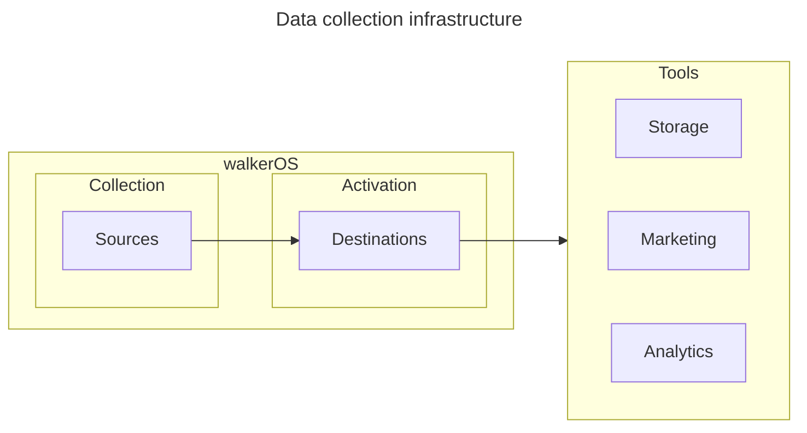
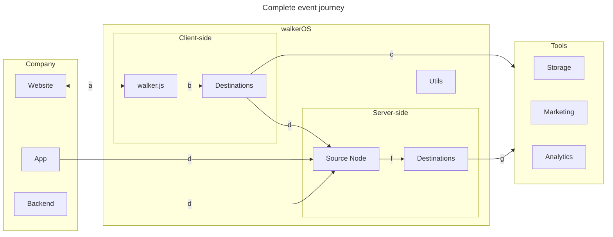

import Link from '@docusaurus/Link';

# Welcome to walkerOS

walkerOS is an **event data collection and tag management solution as code**. It
captures, structures, queues, and routes events with built-in support
for&nbsp;<Link to="/docs/consent_management/overview">consent management</Link>
— all directly in your code. No fragile UI configs. No black-box logic. Just
tracking you can **version, test, and trust**.

The project started as the lightweight web tracking
library&nbsp;<Link to="/docs/collectors/web-collector/">walker.js</Link>, and has
evolved into a **complete first-party tracking system** for modern teams and the
modern web.

## Why walkerOS?

- **Full data ownership**: Your data stays yours. No vendor lock-in, no
  third-party dependencies, complete control over how data is captured,
  processed and shared.
- **Scalable tagging**: DOM-based, component-level frontend tagging makes
  tracking declarative, reusable, and easy to maintain.
- **Privacy-first by design**: Built-in consent handling and privacy controls
  help you meet compliance from day one.
- **Tag management as code**: Replace complex UIs with clean, version-controlled
  tracking logic.

## How walkerOS operates

walkerOS is a streamlined framework with a
standardized&nbsp;<Link to="/docs/getting_started/event-model">event
model</Link>.

### Basic infrastructure

- <Link to="/docs/getting_started/sources">**Sources**</Link>: Event collection and state
  management
- <Link to="/docs/getting_started/destinations">**Destinations**</Link>: Initializing, mapping,
  and routing events to 3rd-party tools

### Complete infrastructure

#### Example event journey

- **a**:&nbsp;<Link to="/docs/collectors/web-collector/">walker.js</Link> initializes
  event listeners and
  interprets&nbsp;<Link to="/docs/sources/html-tagging">tagging</Link> on a
  page.
- **b**:&nbsp;<Link to="/docs/collectors/web-collector/">walker.js</Link> verifies
  that&nbsp;<Link to="/docs/collectors/web-collector/commands#consent">user
  consent</Link> has been granted,
  eventually&nbsp;<Link to="/docs/destinations/event_mapping#init">initializes</Link>
  and&nbsp;<Link to="/docs/destinations/event_mapping">maps</Link> events to the
  appropriate <Link to="/docs/getting_started/destinations">destinations</Link>.
- **c**: Events are&nbsp;<Link to="/docs/destinations/event_mapping">formatted
  correctly</Link> and sent directly to the respective tools from the source.
- **d**: Events can be sent to a (public) endpoint from various sources, running
  the&nbsp;<Link to="/docs/collectors/node-collector/">node source</Link>
- **f**: Similar to client-side operations, consent gets verified,
  a&nbsp;<Link to="/docs/getting_started/destinations">destination</Link> is
  eventually&nbsp;<Link to="/docs/destinations/event_mapping#init">initialized</Link>,
  and events are processed server-side.
- **g**: Events are formatted correctly and sent to tools from the server.

:::info

If you need professional support with your walkerOS implementation, check out
our&nbsp;<Link to="/services">services</Link>.

:::
