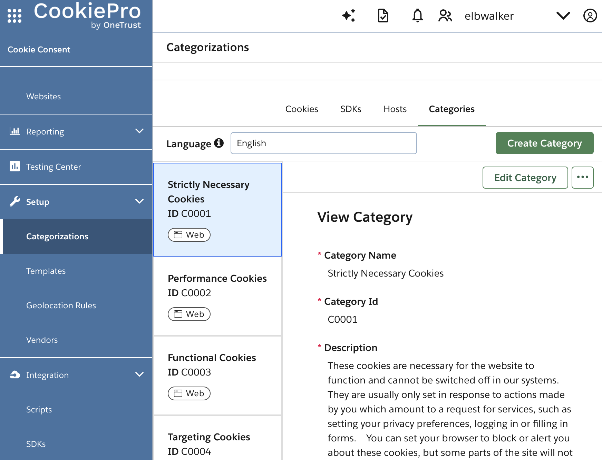

CookiePro registers cookies and assigns them to categories. Those categories can
be mapped to match the walker.js consent groups.

## Event listener

The following code works asynchronously with CookiePro's
[OptanonActiveGroups](https://my.onetrust.com/s/article/UUID-66bcaaf1-c7ca-5f32-6760-c75a1337c226).
The code won't override an eventually existing `OptanonWrapper`. The `mapping`
translated the CookiePro categories to the walker.js consent groups and is an
example of how to map the CookiePro categories to the walker.js

<CodeBox
  code={`(function (wrapper) {
// Renaming of the categories
const mapping = {
C0001: 'functional', // necessary
C0002: 'analytics', // performance
C0003: 'analytics', // functional
C0004: 'marketing', // targeting
C0005: 'marketing', // social
};

function handleConsent() {
// if (!OneTrust.IsAlertBoxClosed()) return; // Process only explicit consent

const consent = {};
window.OptanonActiveGroups.split(',').forEach((category) => {
const name = mapping[category];
if (name) consent[name] = true;
});

elb('walker consent', consent);
}

if (window.Optanon && window.OptanonActiveGroups) {
handleConsent(); // CMP already loaded
} else {
window.OptanonWrapper = function (e) {
if (wrapper) wrapper(); // Call the original OptanonWrapper
handleConsent();
};
}

// Listen for consent updates
window.addEventListener('OneTrustGroupsUpdated', function (event) {
handleConsent();
});
})(window.OptanonWrapper);
`}
  disabled
  language="javascript"
  label="Code Example"
  showHeader={false}
  autoHeight
/>

Adjust the mapping according to the CookiePro categories and the associated
tools.

Optionally uncomment the `IsAlertBoxClosed` check to process explicit consent
only. This will prevent the walker.js from starting unintentionally or running
eventually running twice.

Ensure the [elb](/docs/sources/web/browser/commands#elb) function is available.
