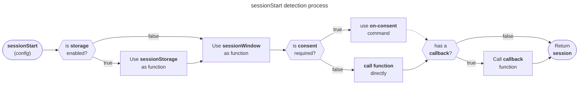
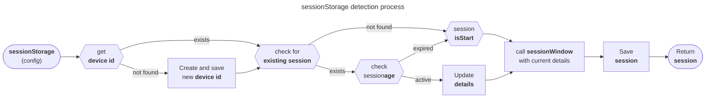
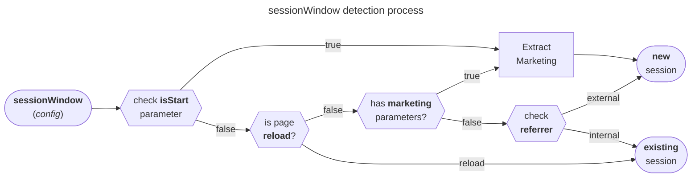

# Session

import PackageLink from '@site/src/components/docs/package-link';

<PackageLink
  github="packages/web/core/src/session"
  npm="@walkeros/web-core"
/>

There are multiple ways to define and measure a session. Sessions represent a
period when a user actively engages with a website, often used for attribution
and conversion tracking. Different tools may define and detect sessions in
different ways.

The `sessionStart` util helps to detect a new session independently and triggers
a `session start` event or [executes custom code](#callback). It works
client-side and is cookieless by default. The Util returns
[Session Data](#session-data) information. There are
[Config Parameters](#config-parameters) to customize the session detection.

In the cookieless mode (default), only the [sessionWindow](#sessionwindow) Util
is used. With config parameter `storage: true`, the
[sessionStorage](#sessionstorage) gets called before the `sessionWindow`.

:::note

Working with storage usually requires consent and is not activated by default. Use the [consent](#consent) option to control the storage
access permissions.

:::

## Session data

Depending on the `storage` and `consent` parameters, the `sessionStart` function
returns an object with several properties. If a new session is detected,
`isStart` is set to `true`, otherwise `false`.

| Property  | Type    | Description                                         |
| --------- | ------- | --------------------------------------------------- |
| isStart   | boolean | If this is a new session or a known one             |
| storage   | boolean | If the storage was used to determine the session    |
| id        | string  | Randomly generated or previously stored session id  |
| start     | number  | Timestamp of session start                          |
| marketing | boolean | If the session was started by a marketing parameter |
| referrer  | string  | Hostname of the referring site if available         |

With `storage: true` and granted `consent`, the returning object will be
extended with the following:

| Property | Type    | Description                                       |
| -------- | ------- | ------------------------------------------------- |
| updated  | number  | Timestamp of last update                          |
| isNew    | boolean | If this is the first visit on a device            |
| device   | string  | Randomly generated or previously stored device id |
| count    | number  | Total number of sessions                          |
| runs     | number  | Total number of runs (like page views)            |

## sessionStart

Example of calling `sessionStart` on a user's first visit:

<CodeSnippet
  code={`// On page https://www.walkeros.io/docs/session?utm_campaign=docs
sessionStart({ storage: true });

// will automatically create the event
{
  event: "session start",
  data: {
    isStart: true,
    storage: true,
    id: 'r4nd0m1d',
    start: 1711715862000,
    marketing: true,
    campaign: 'docs',
    // Additionally in storage mode
    updated: 1711715862000,
    isNew: true,
    device: 'd3v1c31d',
    count: 1,
    runs: 1,
  },
  // ...
}`}
  language="javascript"
/>

:::info

In addition, with `storage: true` and optionally granted `consent`, the `id` and
`device` values are set automatically as `user.session` and `user.device` ids.

:::

### Config parameters

The `sessionStart` function is designed to work out of the box. All parameters
are optional for customization:

| Parameter           | Type                   | Description                                                                                          |
| ------------------- | ---------------------- | ---------------------------------------------------------------------------------------------------- |
| [consent](#consent) | Array&lt;string&gt;    | The consent state to permit or deny storage access                                                   |
| [storage](#storage) | boolean                | If the storage should be used                                                                        |
| [cb](#callback)     | false or function | Callback function called after detection, or `false` to disable the default callback |

:::info

There are additional config parameters [for storage](#sessionstorage) and
[for window](#sessionwindow) available.

:::

#### Consent

Setting a consent state to wait for before detecting a new session is used to
decide if storage access is allowed or not. If set, it registers an
[on consent event](/docs/collector/commands#on) and won't start until a
consent choice is available. If at least one permission was granted, the
`sessionStorage` detects a new session; otherwise, the `sessionWindow`.

<CodeSnippet
  code={`sessionStart({ consent: 'marketing' }); // Won't start automatically
// User makes a consent choice and CMP calls:
elb('walker consent', { marketing: true }); // Triggers the session detection
// Returns a session with storage access`}
  language="javascript"
/>

#### Storage

Option to enable the [sessionStorage](#sessionstorage) util to detect a new
session with more accuracy and enhanced data.

<CodeSnippet
  code={`sessionStart({ storage: true });`}
  language="javascript"
/>

#### Callback

The `cb` parameter can be used to disable the default callback or to define a
custom one. The default callback triggers a `session start` event if `isStart`
is `true`. And additionally, with `storage: true`, the user's `session` and
`device` ids are also set via `elb('walker user', user);`. The default callback
function is passed as the third parameter.

<CodeSnippet
  code={`const session = sessionStart({ cb: false }); // Disables the default callback

sessionStart({
  cb: (session, instance, defaultCb) => {
    console.log(session);
    defaultCb(session, instance); // Call the default callback
  },
});`}
  language="javascript"
/>

### Detection process

Based on the [storage](#storage) option either the
[sessionStorage](#sessionstorage) or the [sessionWindow](#sessionwindow) is used
to detect a new session. If a [consent](#consent) state is set, the session
detection gets scheduled via an [on-consent](/docs/collector/commands#on)
command. It will only run once per `run`.

## sessionStorage

### Config parameters

Additional config parameters for storage-based session detection:

| Property       | Type    | Description                                                  | Default      |
| -------------- | ------- | ------------------------------------------------------------ | ------------ |
| deviceKey      | string  | The key to store the device ID in the storage                | elbDeviceId  |
| deviceStorage  | string  | The storage type to use for the device id                    | local        |
| deviceAge      | number  | The age in days to consider the device ID as expired         | 30           |
| sessionKey     | string  | The key to store the session ID in the storage               | elbSessionId |
| sessionStorage | string  | The storage type to use for the session id                   | local        |
| length         | number  | Minutes after the last update to consider session as expired | 30           |
| pulse          | boolean | Update the current session to stay active                    | false        |

:::info

There are additional config parameters for [sessionWindow](#sessionwindow)
available.

:::

### Detection process

Basic rules to detect a new session:

## sessionWindow

### Config parameters

| Parameter                              | Type    | Description                                                              |
| -------------------------------------- | ------- | ------------------------------------------------------------------------ |
| [data](#custom-data)                   | object  | Custom data to enhance the default `data` properties                     |
| [domains](#internal-domains)           | array   | Internal domains to prevent new sessions from triggering when navigating |
| [isStart](#manual-new-session-control) | boolean | Manual new session control                                               |
| [parameters](#marketing-parameters)    | object  | Marketing parameters to enhance the default and support custom ones      |
| [referrer](#referrer-customization)    | string  | Referrer customization                                                   |
| [url](#url-customization)              | string  | URL customization                                                        |

#### Custom Data

Enhance the default `data` properties with custom information, like a session
count:

<CodeSnippet
  code={`const count = 2;
const session = sessionStart({ data: { count } });`}
  language="javascript"
/>

This will return a `data` object like `{ id: "r4nd0m", count: 2 }`.

#### Internal Domains

Define internal domains to prevent new sessions from triggering when navigating
between them:

<CodeSnippet
  code={`const session = sessionStart({
  domains: ['subdomain.walkeros.io', 'example.com'],
});`}
  language="javascript"
/>

A user coming from `subdomain.walkeros.io` or `example.com` to e.g.
`www.walkeros.io`, will no longer trigger a new session.

#### Manual New Session Control

Determine if it's a new session using the `isStart` parameter. This might
require consent for storage access, which isn't implemented by default.

Usually, the `sessionId` written to the storage is set up to expire and should
be updated with each page view. If the `sessionId` is missing, it may be an
expired but at least a new session.

<CodeSnippet
  code={`if (!storageRead('sessionId')) {
  const session = sessionStart({ isStart: true });
  storageWrite('sessionId', session.id);
}`}
  language="javascript"
/>

> For more information on storage and expiration, check the storage
> configuration options in this guide.

#### Marketing Parameters

The helper util `getMarketingParameters` is used to extract common parameters like all
`utm variants`, typical clickIds like `fbclid`, `gclid`, and others.

To enhance the default and support custom ones add `parameters`, like
`{ elb_campaign: 'campaign' }` to add `campaign: "docs"` to `data` for a url
with `?elb_campaign=docs`.

A session with marketing parameters will be flagged with `data.marketing = true`
automatically.

<CodeSnippet
  code={`interface MarketingParameters {
  [key: string]: string;
}

sessionStart({
  parameters: { elb_campaign: 'docs' },
});`}
  language="typescript"
/>

#### Referrer Customization

By default the `document.referrer` is used, but it can be overwritten with the
`referrer` parameter.

<CodeSnippet
  code={`sessionStart({ referrer: 'https://example.com' });`}
  language="javascript"
/>

Domains can be extended, e.g., internal sub-domains. Data can be pre-defined,
e.g., to use your ID.

#### URL Customization

By default, the `window.location.href` is used, but it can be overwritten with
the `url` parameter.

<CodeSnippet
  code={`sessionStart({ url: 'https://example.com' });`}
  language="javascript"
/>

### Detection process

Basic rules to detect a new session:

0. **Storage Check** (_Optional_): First, check for an existing sessionId in
   storage. If none is found, consider it a new session. This usually requires
   consent.
1. **Page reload**: If the entry type is a page reload, it's not a new session.
2. **Marketing Parameters**: The presence of marketing parameters in the URL
   indicates a new session.
3. **Referrer Check**: A different referrer from the current domain signals a
   new session.

:::note

Be aware of potential multiple unintended events for the same user due to
referrer hiding. For more details, learn about
[Referrer Hiding](https://en.wikipedia.org/wiki/HTTP_referer#Referrer_hiding).

:::
