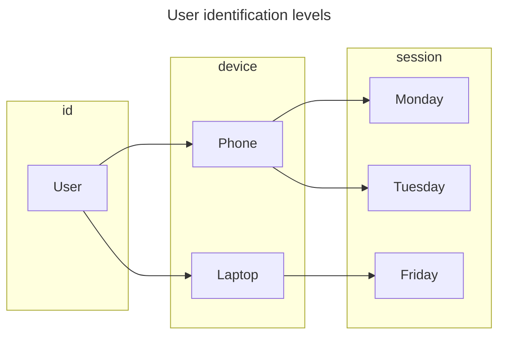

import Link from '@docusaurus/Link';

To combine website and mobile app data, to unify customer interaction data
across different platforms, or to generally track a user's journey through
various touchpoints, **user stitching** is required. It is a technique to
combine data from multiple sources or sessions to create a unified view of a
user. This is especially useful in scenarios where a user interacts with a
system across multiple devices or platforms, and the goal is to consolidate
these interactions into a single, coherent user profile.

In general, when working with user behavior data, there's always a high chance
of incomplete data. Especially in such a volatile environment like the web,
where users can easily **delete cookies**, **change devices**, or simply use a
**different browser**. Understanding user identification to stitch correctly is
key.

Working with persistent identifiers requires a **user's consent**. Consent is
always bound to specific purposes, which have to be documented and communicated
properly.

:::tip

Learn more about&nbsp;<Link to="/docs/guides/consent">consent management</Link>
with walkerOS.

:::

Relying on third-party tools and cookies might have been a common practice with
benefits in the past. Support for third-party cookies is phasing out, and there
always has been and will be a dependence on others if data isn't owned and
collected first-party.

First-party data collection is fundamental for **attribution modeling**,
creating a **holistic view** of your users and gaining **data ownership**.

## User identification levels

**User identification** is the process of recognizing the identity of a user.
This typically involves associating a user with a unique identifier. There are
three levels of user identification in walkerOS:

- **id**: Represents a unique identifier for a user, typically drawn from
  internal systems like a CRM.
- **device**: Used as a device-specific identifier, saved in the storage.
- **session**: Refers to a session-specific identifier to track user activities
  within a single session.

A single user can have different devices with multiple sessions. The `id` is
used to distinctly identify an individual user across various sessions and
devices. The `device` helps to recognize a user across multiple sessions on the
same device, providing continuity in tracking user interactions over time, while
`session ` is for understanding user behavior and interactions in a confined
timeframe.

The diagram represents one user with two devices across three sessions.

:::warning

These techniques may require a user's consent and documentation to respect
privacy and stay compliant. Please request your data protection officer for
legal advice.

:::

## Example

Events are individually measured user interactions that need to be stitched
together. All event-related data is additional information to help identifying a
user. This is necessary to create user journeys.

The following table represents a minified event log over several days. It shows
how user activities can be tracked over time, across different sessions, with
varying levels of user identification and consent categories.

A `group` id gets generated with each run, representing a page load. A `hash` is
a temporary fingerprint. `session`, `device`, and `user` are all simplified
unique identifiers.

| Step | Day                 | Event          | Consent   | Group | Hash | Session | Device | User |
| ---- | ------------------- | -------------- | --------- | ----- | ---- | ------- | ------ | ---- |
| 1    | Monday, 1st    | session start  | analytics | a     | foo  |         |        |      |
| 2    | Monday, 1st    | page view      | analytics | a     | foo  |         |        |      |
| 3    | Monday, 1st    | consent deny   | analytics | a     | foo  |         |        |      |
| 4    | Monday, 1st    | page view      | analytics | b     | foo  |         |        |      |
| 5    | Tuesday, 2nd   | session start  | marketing | c     | bar  | 1       | phone  |      |
| 6    | Tuesday, 2nd   | page view      | marketing | c     | bar  | 1       | phone  |      |
| 7    | Tuesday, 2nd   | consent accept | marketing | c     | bar  | 1       | phone  |      |
| 8    | Tuesday, 2nd   | session start  | marketing | d     | bar  | 2       | phone  |      |
| 9    | Tuesday, 2nd   | page view      | marketing | d     | bar  | 2       | phone  |      |
| 11   | Wednesday, 3rd | session start  | marketing | e     | baz  | 3       | phone  | olli |
| 12   | Wednesday, 3rd | page view      | marketing | e     | baz  | 3       | phone  | olli |
| 13   | Wednesday, 3rd | user login     | marketing | e     | baz  | 3       | phone  | olli |
| 14   | Friday, 5th    | session start  | analytics | f     | qux  |         |        |      |
| 15   | Friday, 5th    | page view      | analytics | f     | qux  |         |        |      |
| 16   | Friday, 5th    | page view      | analytics | g     | qux  |         |        | olli |
| 17   | Friday, 5th    | consent deny   | analytics | g     | qux  |         |        | olli |
| 18   | Friday, 5th    | user login     | analytics | g     | qux  |         |        | olli |
| 19   | Thursday, 11th | session start  | marketing | h     | lol  | 4       | ph0n3  |      |

Based on the data, we can at least summarize the following:

- 19 tracked `events` in total
- 8 different `group` ids ('a', 'b', 'c', 'd', 'e', 'f', 'g', 'h')
- 6 individual `session start` events
- 5 temporary `hashes` ('foo', 'bar', 'baz', 'qux', 'lol')
- 4 reliable `sessions` (1, 2, 3, 4)
- 2 known `devices` ('phone' and 'ph0n3')
- 1 unique `user` ('olli')

The example illustrates the complexity and richness of user data captured
through user stitching.
