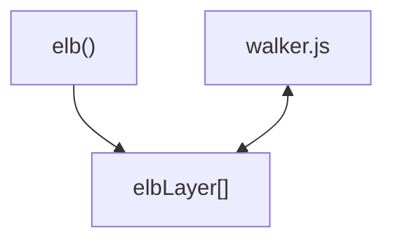

import Link from '@docusaurus/Link';

The walker is designed to support asynchronous communication through the
elbLayer array. With the creation of the `Walkerjs`, the `elbLayer` items are
scanned. The walker will process each push. Use the `elb` function as a handy
helper.

The communication works entirely asynchronously. The `elb` function pushes
events to the `elbLayer`. The `walker.js` will process the stack and each push.



## elb

```js
// Import
import { elb } from '@elbwalker/walker.js';
window.elb = elb;

// Or define the elb function manually in the browser as an alternative
function elb() {
  (window.elbLayer = window.elbLayer || []).push(arguments);
}
```

Usage options

```js
elb("entity action", data, ...);
elb({event: "entity action", data: { foo: "bar"}});
```

## Configuration

To&nbsp;<Link to="/docs/sources/walkerjs/installation/#configuration">configure
walker.js</Link> either do it while creating an instance or use the
`walker config` command. There are options available before a `run` is called:

```js
elb('walker config', {
  consent: { functional: true }, // Initial consent states, learn more under consent
  elb: 'elb', // Name of assign the elb function to the window
  elbLayer: window.elbLayer, // Public elbwalker API for async communication (only prior run)
  globals: {}, // Static attributes added to each event
  instance: 'walkerjs', // Name of the walkerjs instance to assign to the window
  pageview: true, // Trigger a page view event by default
  prefix: 'data-elb', // Attributes prefix used by the walker
  user: { id: '', device: '', session: '' }, // Setting the user ids
  tagging: 0, // Current version of the tracking setup
});
```

After the `run` command, only `globals` and `tagging` can be updated.

## Run

A `run` can be seen like a regular page view. It will start the walker.js and
(re-)Initialize the handler, reset counters, clear queues, and update the
globals. A `page view` event is triggered by default, the tagging is checked for
`load` actions, and the `elbLayer` stack is processed.

```js
elb('walker run');
```

A run accepts a partial `State` parameter to predefine the state of the
walker.js:

```js
elb('walker run', { group: 'gr0up1d' });
```

## Initialization

(Re-)initializes event listeners on one or multiple target elements. Can be used
e.g., asynchronously loaded content like newly added products in a category list
or a wizard.

```js
elb('walker init', element); // or an array of elements
```

## Destinations

Run the `walker destination` command to add a destination to the walker.js.
Individual destination configurations can be made by using the
destination.config property.

```js
const destinationLog = { push: console.log }; // Demo destination for console.log
elb('walker destination', destinationLog);

import destinationGTM from '@elbwalker/destination-web-google-gtm';
elb('walker destination', destinationGTM, {
  /* custom config */
});
```

## Consent Management

:::info

Learn more about&nbsp;<Link to="/docs/guides/consent_management/">consent
management in detail</Link>.

:::

Those names can be defined arbitrarily, but common groups are functional,
analytics, and marketing. Values are booleans, and once a value is set to `true`
it's treated as consent being granted. Previously pushed events during the run
are now shared with destinations and new ones.

```js
elb('walker consent', { marketing: true, randomTool: true });
```

Setting a consent state to `false` will immediately stop a destination from
processing any events.

## On-Events

The `on` command adds event listeners to the walker.js. They get called when the
type changes with `run` or `consent`.

```js
elb('walker on', type, options);
```

`Options` depend on the `type` and can also be an array for multiple listeners
at once.

### Run

With each `run`, the on-event will be called with `instance` as a parameter.

```js
elb('walker on', 'run', function (instance) {
  console.log('run with', { instance });
});
```

Every time the `run` command is called, the function will be executed:

```js
const walkerjs = Walkerjs({ run: true });
// Output: run with { instance: { ... } }
elb('walker run');
// Output: run with { instance: { ... } }
```

### Consent

Every time the `consent` changes, the rules-matching function(s) will be called
with the parameters `instance`, and `consent`, which is the current consent
state.

```js
function onConsent(instance, consent) {
  console.log('consent with', { instance, consent });
  if (consent.marketing) elb('walker user', readFromStorage());
}

//   command      type        rule       function
elb('walker on', 'consent', { marketing: onConsent });
```

The `onConsent` function will only be called when the `marketing` consent
changes:

```js
elb('walker consent', { functional: true }); // Won't trigger the onConsent function
elb('walker consent', { marketing: true }); // Will trigger the onConsent function
```

## User

Setting the user IDs. There are three levels for user identification. Typically,
the user is a company's internal ID. In contrast, the device ID can be treated
as a value stored in a cookie for a more extended period, and the session can be
used for temporary identification.

```js
elb('walker user', { id: 'us3r', device: 'c00k13', session: 's3ss10n' });
```

The new user IDs have been added to each event. Make sure only to use hashed or
anonymous ids.

```js
{
  "event": "entity action",
  "user": {
    "id": "us3r",
    "device": "c00k13",
    "session": "s3ss10n"
  }
  // other properties omitted
}
```

:::info

Learn more about identification
and&nbsp;<Link to="/docs/guides/user_stitching">user stitching</Link> in the
guides.

:::

:::caution

We highly recommend only using fully anonymized & arbitrary IDs by default and
checking your options with persistent user IDs with your data protection
officer.

:::

## custom

```js
elb('walker custom', { key: 'value' });
```

## globals

```js
elb('walker globals', { key: 'value' });
```

## Hooks

Hooks can be used to customize the default behavior of the walker.js. Three
hooks are available: `Push`, `DestinationInit`, and `DestinationPush`. Hooks
allows for validation, manipulation, or even eventual cancellation of default
behavior.

The `walker hook` command adds a function to the walker.js to customize or
enhance default processing.

```js
elb('walker hook', '<moment>', hookFn);
```

#### Moments

The overall function execution order is as follows:

1. prePush
2. preDestinationInit
3. postDestinationInit
4. preDestinationPush or preDestinationPushBatch
5. postDestinationPush or postDestinationPushBatch
6. postPush

Others are:

- preSessionStart
- postSessionStart

#### Function signatures

In general, `params` will be prefixed as a parameter, containing `fn` which is
the original function and `result` for the post-hooks. Use the following
function signatures:

```js
// Push
function prePush(params, event, data, options, context, nested) {
  return params.fn(event, data, options, context, nested);
}
function postPush(params, event, data, trigger, context, nested) {
  console.log('default return result', params.result);
  return;
}

// DestinationInit
function preDestinationInit(params, config) {
  return params.fn(config);
}
function postDestinationInit(params, config) {
  console.log('default return result', params.result);
  return params.result;
}

// DestinationPush
function preDestinationPush(params, event, config, mapping, runState) {
  console.log('default return result', params.result);
  return params.fn(event, config, mapping, runState);
}
function postDestinationPush(params) {
  // Custom code with a void return
  return;
}

// DestinationPushBatch
function preDestinationPushBatch(params, event, config, mapping, runState) {
  console.log('default return result', params.result);
  return params.fn(event, config, mapping, runState);
}
function postDestinationPushBatch(params) {
  // Custom code with a void return
  return;
}
```

#### Adding a hook

To add a hook, either add the `hooks` during initialization or call the `hook`
command:

```js
const walkerjs = Walkerjs({
  hooks: {
    // Add hooks on init
    prePush: (params, ...args) => {
      window.elbTimer = Date.now();
      return params.fn(...args);
    },
  },
});

// Add hooks via command
elb('walker hook', 'postPush', function (params, ...args) {
  console.log('walker exec time', Date.now() - window.elbTimer);
});

elb('entity action');

// Output:
// walker exec time 1
```

:::note

To learn more about hooks, visit the<Link to="/docs/utils/hooks">
Utils/Hooks</Link> section.

:::
