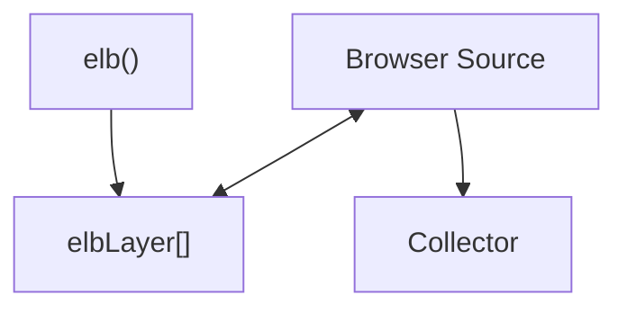

# Browser source commands

The browser source provides an enhanced `elb` function that supports
browser-specific features like DOM interaction, elbLayer communication, and
automatic initialization. These commands are processed by the browser source
translation layer before being passed to the collector.

## elb

The browser source provides an enhanced `elb` function that supports flexible
argument patterns and browser-specific features.

<CodeSnippet
  code={`// Import from browser source
import { elb } from '@walkeros/web-source-browser';
window.elb = elb;

// Or define the elb function manually in the browser
function elb() {
(window.elbLayer = window.elbLayer || []).push(arguments);
}`}
  language="javascript"
/>

Usage options:

<CodeSnippet
  code={`elb("entity action", data, ...);
elb({event: "entity action", data: { foo: "bar"}});`}
  language="javascript"
/>

## config

Configure the browser source during initialization through `startFlow`. These
settings control browser-specific behavior:

<CodeSnippet
  code={`import { startFlow } from '@walkeros/collector';
import { sourceBrowser } from '@walkeros/web-source-browser';

const { collector } = await startFlow({
sources: {
browser: {
code: sourceBrowser,
config: {
  settings: {
    elb: 'elb', // Name to assign the elb function to the window
    elbLayer: true, // Enable elbLayer for async command queuing
    pageview: true, // Trigger a page view event by default
    prefix: 'data-elb', // Attributes prefix used by the walker for DOM scanning
    session: true, // Enable session tracking
  },
},
},
},
});`}
  language="javascript"
/>

:::note

Browser source configuration must be done during initialization.
Settings like `prefix` and `elbLayer` cannot be changed after the source is
created.

:::

## run

A `run` initializes the browser source and triggers automatic DOM scanning and
event setup. It will:

* Initialize DOM event listeners
* Scan for `data-elb` attributes
* Trigger a `page view` event by default
* Process the `elbLayer` stack

<CodeSnippet
  code={`elb('walker run');`}
  language="javascript"
/>

A run accepts a partial state parameter:

<CodeSnippet
  code={`elb('walker run', { group: 'group1d' });`}
  language="javascript"
/>

### Virtual pageviews in SPAs

Use `walker run` to trigger virtual pageviews when navigating between routes in
Single Page Applications. Call it on each route change to fire a new `page view`
event and re-scan the DOM:

<CodeSnippet
  code={`// React Router example
useEffect(() => {
  window.elb('walker run');
}, [location]);

// Next.js App Router example
useEffect(() => {
  window.elb('walker run');
}, [pathname]);`}
  language="javascript"
/>

:::tip

For SPAs, use `walker run` for route changes (triggers pageview), and
`walker init` for dynamically loaded content within the same page (no pageview).

:::

## init

Re-initializes event listeners on one or multiple target elements without
triggering a page view. Useful for dynamically loaded content like product
lists, infinite scroll, or wizard steps.

<CodeSnippet
  code={`elb('walker init', element); // Single element
elb('walker init', [element1, element2]); // Multiple elements`}
  language="javascript"
/>

This command is essential for Single Page Applications (SPAs) where content is
added dynamically after the initial page load.

<CodeSnippet
  code={`// After loading new products via AJAX
const productList = document.getElementById('product-list');
fetchProducts().then(() => {
  elb('walker init', productList);
});`}
  language="javascript"
/>

:::tip

Use `walker init` after adding new DOM elements with `data-elb` attributes.
Unlike `walker run`, this does not trigger a page view event - it only enables
tracking on the specified elements.

:::

## run vs init comparison

| Command | Triggers pageview | Re-scans DOM | Use case |
|---------|------------------|--------------|----------|
| `walker run` | Yes | Full page | SPA route changes, virtual pageviews |
| `walker init` | No | Target elements only | Dynamically loaded content (product lists, infinite scroll) |

## Integration with collector

Browser source commands work in conjunction
with <Link to="/docs/collector/commands">collector commands</Link>. The
browser source handles DOM-specific functionality while the collector manages
destinations, consent, and user data.

Common workflow:

1. Configure browser source in `startFlow`
2. Browser source automatically initializes (or use `walker run` for manual
   control)
3. Use `walker init` for dynamic content
