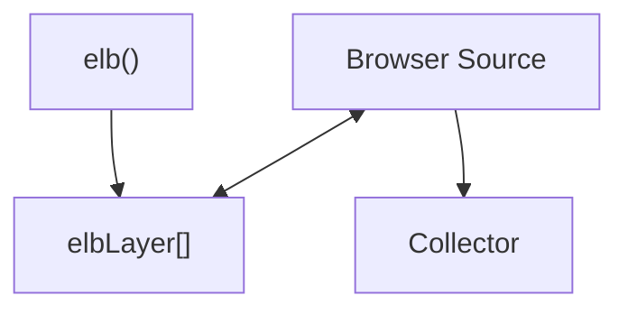

***

title: Commands
description: Browser source API methods and commands
path: /docs/sources/web/browser/commands
sidebar\_position: 3
--------------------

import Link from '@docusaurus/Link';

import { CodeBox } from '@walkeros/explorer';

# Browser Source Commands

The browser source provides an enhanced `elb` function that supports
browser-specific features like DOM interaction, elbLayer communication, and
automatic initialization. These commands are processed by the browser source
translation layer before being passed to the collector.

## elb

The browser source provides an enhanced `elb` function that supports flexible
argument patterns and browser-specific features.

<CodeBox
  code={`// Import from browser source
import { elb } from '@walkeros/web-source-browser';
window.elb = elb;

// Or define the elb function manually in the browser
function elb() {
(window.elbLayer = window.elbLayer || []).push(arguments);
}
`}
  disabled
  language="javascript"
  label="Code Example"
  showHeader={false}
  autoHeight={{ min: 100, max: 600 }}
/>

Usage options:

<CodeBox
  code={`elb("entity action", data, ...);
elb({event: "entity action", data: { foo: "bar"}});
`}
  disabled
  language="javascript"
  label="Code Example"
  showHeader={false}
  autoHeight={{ min: 100, max: 600 }}
/>

## config

Configure the browser source during initialization through `startFlow`. These
settings control browser-specific behavior:

<CodeBox
  code={`import { startFlow } from '@walkeros/collector';
import { sourceBrowser } from '@walkeros/web-source-browser';

const { collector } = await startFlow({
sources: {
browser: {
code: sourceBrowser,
config: {
  settings: {
    elb: 'elb', // Name to assign the elb function to the window
    elbLayer: true, // Enable elbLayer for async command queuing
    pageview: true, // Trigger a page view event by default
    prefix: 'data-elb', // Attributes prefix used by the walker for DOM scanning
    session: true, // Enable session tracking
  },
},
},
},
});
`}
  disabled
  language="javascript"
  label="Code Example"
  showHeader={false}
  autoHeight={{ min: 100, max: 600 }}
/>

:::note

Browser source configuration must be done during initialization.
Settings like `prefix` and `elbLayer` cannot be changed after the source is
created.

:::

## run

A `run` initializes the browser source and triggers automatic DOM scanning and
event setup. It will:

* Initialize DOM event listeners
* Scan for `data-elb` attributes
* Trigger a `page view` event by default
* Process the `elbLayer` stack

<CodeBox
  code={`elb('walker run');
`}
  disabled
  language="javascript"
  label="Code Example"
  showHeader={false}
  autoHeight={{ min: 100, max: 600 }}
/>

A run accepts a partial state parameter:

<CodeBox
  code={`elb('walker run', { group: 'group1d' });
`}
  disabled
  language="javascript"
  label="Code Example"
  showHeader={false}
  autoHeight={{ min: 100, max: 600 }}
/>

## init

Re-initializes event listeners on one or multiple target elements. Useful for
dynamically loaded content like newly added products or wizard steps.

<CodeBox
  code={`elb('walker init', element); // Single element
elb('walker init', [element1, element2]); // Multiple elements
`}
  disabled
  language="javascript"
  label="Code Example"
  showHeader={false}
  autoHeight={{ min: 100, max: 600 }}
/>

This command is essential for Single Page Applications (SPAs) where content is
added dynamically after the initial page load.

:::tip

Use `walker init` after adding new DOM elements with `data-elb` attributes to
ensure they are tracked properly.

:::

## Integration with Collector

Browser source commands work in conjunction
with <Link to="/docs/collector/commands">collector commands</Link>. The
browser source handles DOM-specific functionality while the collector manages
destinations, consent, and user data.

Common workflow:

1. Configure browser source in `startFlow`
2. Browser source automatically initializes (or use `walker run` for manual
   control)
3. Use `walker init` for dynamic content
