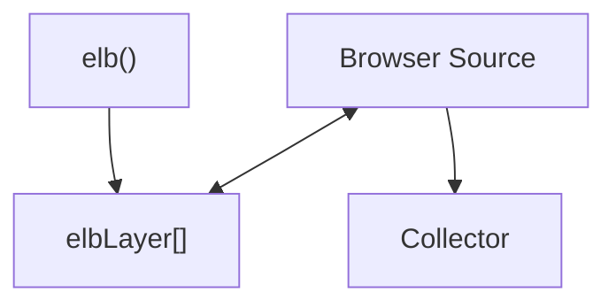

import Link from '@docusaurus/Link';

# Browser Source Commands

The browser source provides an enhanced `elb` function that supports browser-specific features like DOM interaction, elbLayer communication, and automatic initialization. These commands are processed by the browser source translation layer before being passed to the collector.



## elb

The browser source provides an enhanced `elb` function that supports flexible argument patterns and browser-specific features.

```js
// Import from browser source
import { elb } from '@walkerOS/web-source-browser';
window.elb = elb;

// Or define the elb function manually in the browser
function elb() {
  (window.elbLayer = window.elbLayer || []).push(arguments);
}
```

Usage options:

```js
elb("entity action", data, ...);
elb({event: "entity action", data: { foo: "bar"}});
```

## config

Configure the browser source during initialization. These settings control browser-specific behavior:

```js
elb('walker config', {
  elb: 'elb', // Name to assign the elb function to the window
  elbLayer: window.elbLayer, // Public elbwalker API for async communication (only prior run)
  pageview: true, // Trigger a page view event by default
  prefix: 'data-elb', // Attributes prefix used by the walker for DOM scanning
  instance: 'walkerjs', // Name of the walkerjs instance to assign to the window
});
```

:::note

Browser source configuration should be done before the collector `run` command. Some settings like `prefix` and `elbLayer` can only be set during initialization.

:::

## run

A `run` initializes the browser source and triggers automatic DOM scanning and event setup. It will:
- Initialize DOM event listeners
- Scan for `data-elb` attributes
- Trigger a `page view` event by default
- Process the `elbLayer` stack

```js
elb('walker run');
```

A run accepts a partial state parameter:

```js
elb('walker run', { group: 'group1d' });
```

## init

Re-initializes event listeners on one or multiple target elements. Useful for dynamically loaded content like newly added products or wizard steps.

```js
elb('walker init', element); // Single element
elb('walker init', [element1, element2]); // Multiple elements
```

This command is essential for Single Page Applications (SPAs) where content is added dynamically after the initial page load.

:::tip

Use `walker init` after adding new DOM elements with `data-elb` attributes to ensure they are tracked properly.

:::

## Integration with Collector

Browser source commands work in conjunction with&nbsp;<Link to="/docs/collector/commands">collector commands</Link>. The browser source handles DOM-specific functionality while the collector manages destinations, consent, and user data.

Common workflow:
1. Configure browser source with `walker config`
2. Initialize with `walker run`  
3. Set up collector features like destinations and consent
4. Use `walker init` for dynamic content
