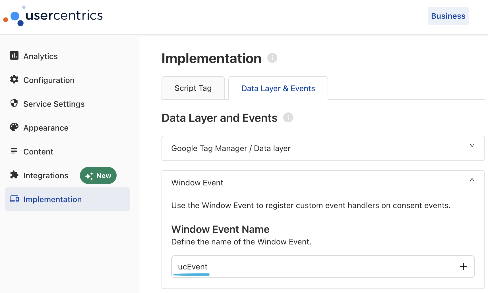

## Installation

```bash
npm install @walkeros/web-source-cmp-usercentrics
```

## Usage

```typescript
import { startFlow } from '@walkeros/collector';
import { sourceUsercentrics } from '@walkeros/web-source-cmp-usercentrics';

await startFlow({
  sources: {
    consent: {
      code: sourceUsercentrics,
      config: {
        settings: {
          eventName: 'ucEvent', // Must match your Usercentrics admin config
          categoryMap: {
            essential: 'functional',
            functional: 'functional',
            marketing: 'marketing',
          },
        },
      },
    },
  },
});
```

## Settings

| Setting        | Type                     | Default             | Description                                              |
| -------------- | ------------------------ | ------------------- | -------------------------------------------------------- |
| `apiVersion`   | `'auto' \| 'v2' \| 'v3'` | `'auto'`            | Which Usercentrics API to target (auto-detects by default)|
| `eventName`    | `string`                 | `'ucEvent'`         | V2 window event name configured in Usercentrics admin    |
| `v3EventName`  | `string`                 | `'UC_UI_CMP_EVENT'` | V3 window event name (overridable for custom admin configs)|
| `categoryMap`  | `Record<string, string>` | `{}`                | Maps Usercentrics categories to walkerOS consent groups  |
| `explicitOnly` | `boolean`                | `true`              | Only process explicit consent (user made a choice)       |

### V2 vs V3 support

The source supports both Usercentrics V2 (`window.UC_UI`) and V3
(`window.__ucCmp`) APIs. With the default `apiVersion: 'auto'`, detection runs
at init:

- If the CMP is already initialized, consent is read **statically** from the
  available API — this fixes the race where V3's `UC_UI_CMP_EVENT` fires before
  walkerOS loads.
- If no CMP is present yet, listeners for **both** V2 and V3 events are
  registered so late-loading CMPs are still caught.
- When both APIs are available, V3 is preferred.

Set `apiVersion: 'v2'` or `'v3'` to force a specific integration.

### Usercentrics setup

Configure a **Window Event** in your Usercentrics admin:
Implementation > Data Layer & Events > Window Event Name (e.g., `ucEvent`).



Alternatively, set `eventName: 'UC_SDK_EVENT'` to use the built-in Browser SDK
event (no admin configuration required).

### Custom mapping example

```typescript
await startFlow({
  sources: {
    consent: {
      code: sourceUsercentrics,
      config: {
        settings: {
          eventName: 'ucEvent',
          categoryMap: {
            essential: 'functional',
            functional: 'functional',
            marketing: 'marketing',
          },
          explicitOnly: true,
        },
      },
    },
  },
});
```

## How it works

1. **API detection**: Reads consent statically from `window.UC_UI` (V2) or
   `window.__ucCmp` (V3) if already initialized, otherwise registers event
   listeners for both APIs so post-init events are still captured.

2. **Group vs. service detection**: Checks if `ucCategory` values are all
   booleans:
   - **Group-level**: Uses `ucCategory` as consent state (maps categories via
     `categoryMap`)
   - **Service-level**: Extracts individual service booleans from `event.detail`
     (normalized to `lowercase_underscores`) and applies `categoryMap` to
     boolean `ucCategory` entries

3. **Explicit filtering**: By default, only processes events where
   `type === 'explicit'` (user actively made a choice). Set
   `explicitOnly: false` to also process implicit/default consent.

4. **Consent command**: Calls `elb('walker consent', state)` with the mapped
   consent state.

### Timing considerations

The source should be initialized before the Usercentrics script loads to avoid
missing the initial consent event. When using `explicitOnly: true` (default),
this is not a concern since the implicit init event is filtered anyway. For
`explicitOnly: false`, ensure the consent source has no `require` constraints
so it initializes immediately.

## Reference

- [Usercentrics Custom Events Documentation](https://support.usercentrics.com/hc/en-us/articles/17104002464668-How-can-I-create-a-custom-event)
- [Source code](https://github.com/elbwalker/walkerOS/tree/main/packages/web/sources/cmps/usercentrics)
