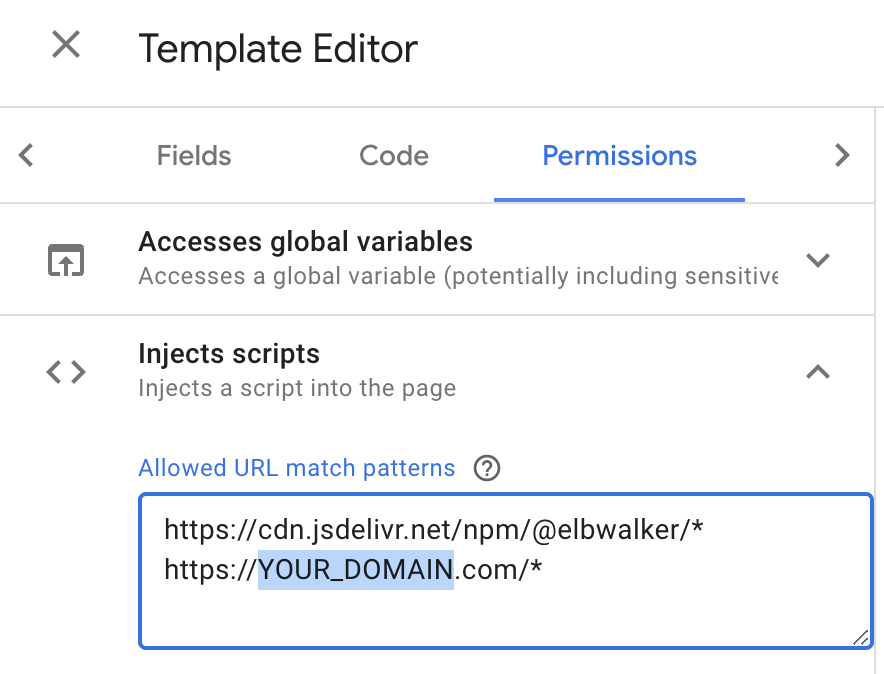

import Tabs from '@theme/Tabs';
import TabItem from '@theme/TabItem';
import { Button } from '/src/components/atoms/buttons';

### Setup

The walkerOS tag template creates a new tag type in Google Tag Manager (GTM)
that allows you to easily load walker.js on your website. Download and import it
once:

<div class="mx-auto mt-5 max-w-md sm:flex sm:justify-center md:mt-8">
  <Button link="TODO">Download GTM Tag Template</Button>
</div>

:::info

The **walkerOS tag template** is currently in review for the official GTM
Template Gallery. In the meantime, it can be imported manually.

:::

To install the walkerOS tag template, follow these steps:

<Tabs>
  <TabItem value="step1" label="Step 1" default>
    In Google Tag Manager, navigate to **Templates** in the left and click on
    **New** in the **Tag Template** section. 
  </TabItem>
  <TabItem value="step2" label="Step 2">
    Click on the **three dots** and **Import** option. Select the previously
    downloaded `walkerOS_tag_template.tpl` file and click the **Save** button.
    
  </TabItem>
  <TabItem value="step3" label="Step 3">
    Now you can **create a new Tag** and select the **walkerOS** tag template
    from the **Custom** section. 
  </TabItem>
</Tabs>

### Installation

There are multiple ways to load walker.js

#### Load walker.js

<Tabs>
  <TabItem value="cdn" label="CDN" default>
    This option loads the walker.js script from an external source (jsDelivr).
    It's good for quick testing, but refers to an external domain. A version can
    be specified. It's recommended to use a specific version starting from
    `2.1.0` 
  </TabItem>
  <TabItem value="self-hosted" label="Self-hosted">
    Save and upload the
    [index.browser.js](https://cdn.jsdelivr.net/npm/@elbwalker/walker.js@latest/dist/index.browser.js)
    to your own server for first-party context and minimize requests to external
    domains.
     

     The GTM is very restrictive when it comes to loading third-party scripts. To load walker.js from a custom domain update the **Tag Template Permissions** and add `YOUR_DOMAIN` to the **Injects scripts** section.

     

  </TabItem>
  <TabItem value="window" label="Window (recommended)">
    A more advanced but **recommended approach** is to fully integrate walker.js without the need to load another file. This reduces the total file-size and the requests for a better performance. 
    The Tag template uses the in the browsers window available factory to create an instance.
    ```js
    import { Walkerjs } from '@elbwalker/walker.js';
    window.Walkerjs = Walkerjs; // Make it globally available
    ```
  </TabItem>
</Tabs>

#### CDN

#### Self hosted

#### Window

#### Permissions

### Options

### Session

### Destination

### On Events

20k character limit
