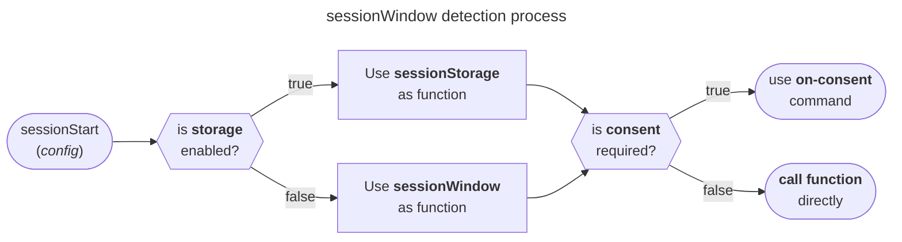
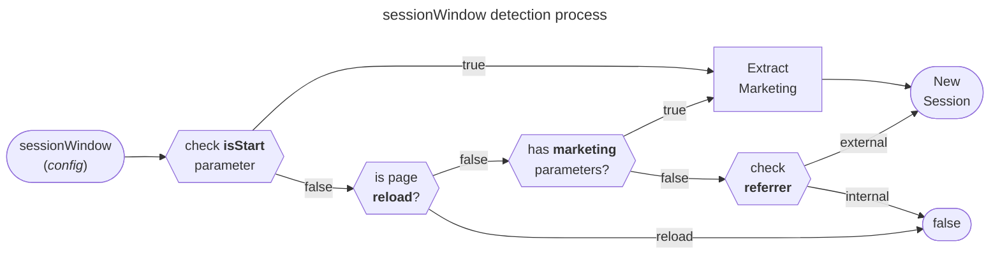

import Link from '@docusaurus/Link';

# Session

import PackageLink from '/src/components/docs/package-link';

<PackageLink github="packages/clients/walkerjs" npm="@elbwalker/walker.js" />
<PackageLink github="packages/utils/src/web/session" npm="@elbwalker/utils" />

There are multiple ways about how to define and measure a session. Sessions
represent a period when a user is actively engaged with a website, often used
for attribution and conversion tracking. Different tools may define and detect
sessions in varying ways.

The `sessionStart` util helps to detect a new session independently, and
triggers a `session start` event or [executes custom code](#callback). It works
client-side and is cookieless by default. The Util returns
[Session Data](#session-data) information. There are
[Config Parameters](#config-parameters) to customize the session detection.

In the cookieless mode (default), only the [sessionWindow](#sessionwindow) Util
is used. With config parameter `storage: true`, the
[sessionStorage](#sessionstorage) gets called before the `sessionWindow`.

:::info

Working with [Storage](/docs/utils/storage) usually requires consent and is not
activated by default. Use the [consent](#consent) option to control the storage
access permissions.

:::

## Session Data

Depending on enabling the `storage` parameter, the `sessionStart` function
returns an object with several properties. If a new session is detected,
`isStart` is set to `true`, otherwise `false`.

| Property  | Type    | Description                                         |
| --------- | ------- | --------------------------------------------------- |
| isStart   | boolean | If this is a new session or a known one             |
| storage   | boolean | If the storage was used to determine the session    |
| id        | string  | Randomly generated or previously stored session id  |
| start     | number  | Timestamp of session start                          |
| marketing | true    | If the session was started by a marketing parameter |

With `storage: true` and eventually granted `consent` the returning object will
be extended with the following:

| Property | Type    | Description                                       |
| -------- | ------- | ------------------------------------------------- |
| updated  | number  | Timestamp of last update                          |
| isNew    | boolean | If this is the first visit on a device            |
| device   | string  | Randomly generated or previously stored device id |
| count    | number  | Total number of sessions                          |
| runs     | number  | Total number of runs (like page views)            |

## sessionStart

Example of calling `sessionStart` on a users first visit:

```js
// On page https://www.elbwalker.com/docs/session?utm_campaign=docs
sessionStart({ storage: true });

// will automatically create the event
{
  event: "session start",
  data: {
    isStart: true,
    storage: true,
    id: 'r4nd0m1d',
    start: 1711715862000,
    marketing: true,
    campaign: 'docs',
    // Additionally in storage mode
    updated: 1711715862000,
    isNew: true,
    device: 'd3v1c31d',
    count: 1,
    runs: 1,
  },
  // ...
}
```

:::info

In addition, with `storage: true` and optionally granted `consent`, the `id` and
`device` values are set automatically as `user.session` and `user.device` ids.

:::

### Config parameters

The `sessionStart` function is designed to work out of the box. All parameters
are optional for customization:

| Parameter           | Type                   | Description                                                                                          |
| ------------------- | ---------------------- | ---------------------------------------------------------------------------------------------------- |
| [consent](#consent) | string                 | The consent state to permit or deny storage access                                                   |
| [storage](#storage) | boolean                | If the storage should be used                                                                        |
| [cb](#callback)     | false or<br />function | Callback function that gets called after the detection process. <br />Or to disable default callback |

:::info

There are additional config parameters [for storage](#sessionstorage) and
[for window](#sessionwindow) available.

:::

#### Consent

#### Storage

#### Callback

### Detection process

Based on the [storage](#storage) option either the
[sessionStorage](#sessionstorage) or the [sessionWindow](#sessionwindow) is used
to detect a new session. If a [consent](#consent) state is set, the session
detection gets scheduled via an
[on-consent](/docs/clients/walkerjs/commands#on-events) command.



## sessionStorage

### Config parameters

Additional config parameters, based on the [Storage](/docs/utils/storage) util:

| Property       | Type   | Description                                              | Default      |
| -------------- | ------ | -------------------------------------------------------- | ------------ |
| deviceKey      | string | The key to store the device id in the storage            | elbDeviceId  |
| deviceStorage  | string | The storage type to use for the device id                | local        |
| deviceAge      | number | The age in days to consider the device id as expired     | 30           |
| sessionKey     | string | The key to store the session id in the storage           | elbSessionId |
| sessionStorage | string | The storage type to use for the session id               | local        |
| sessionAge     | number | The age in days to consider the session id as expired    | 30           |
| length         | number | Minutes after last update to consider session as expired | 30           |

:::info

There are additional config parameters for [sessionWindow](#sessionwindow)
available.

:::

### Detection process

Basic rules to detect a new session:

## sessionWindow

### Config parameters

| Parameter                              | Type    | Description                                                              |
| -------------------------------------- | ------- | ------------------------------------------------------------------------ |
| [data](#custom-data)                   | object  | Custom data to enhance the default `data` properties                     |
| [domains](#internal-domains)           | array   | Internal domains to prevent new sessions from triggering when navigating |
| [isStart](#manual-new-session-control) | boolean | Manual new session control                                               |
| [parameters](#marketing-parameters)    | object  | Marketing parameters to enhance the default and support custom ones      |
| [referrer](#referrer-customization)    | string  | Referrer customization                                                   |
| [url](#url-customization)              | string  | URL customization                                                        |

#### Custom Data

Enhance the default `data` properties with custom information, like a session
count:

```js
const count = 2;
const session = sessionStart({ data: { count } });
```

This will return a `data` object like `{ id: "r4nd0m", count: 2 }`.

#### Internal Domains

Define internal domains to prevent new sessions from triggering when navigating
between them:

```js
const session = sessionStart({
  domains: ['subdomain.elbwalker.com', 'example.com'],
});
```

A user coming from `subdomain.elbwalker.com` or `example.com` to e.b.
`www.elbwalker.com`, will no longer trigger a new session.

#### Manual New Session Control

Determine if it's a new session using the `isStart` parameter. This might
require consent for storage access and therefore isn't implement by default.

Usually, the `sessionId` written to the storage is set up to expire and should
be updated with each page view. If the `sessionId` is missing, it's maybe an
expired but at least a new session.

```js
if (!storageRead('sessionId')) {
  const session = sessionStart({ isStart: true });
  storageWrite('sessionId', session.id);
}
```

> For more information on storage and expiration,
> see&nbsp;<Link to="/docs/utils/storage">Utils/Storage</Link>

#### Marketing Parameters

The helper util <Link to="/docs/utils/helper#getmarketingparameters">
getMarketingParameters</Link> is used to extract common parameters like all
`utm variants`, typical clickIds like `fbclid`, `gclid`, and others.

To enhance the default and support custom ones add `parameters`, like
`{ elb_campaign: 'campaign' }` to add `campaign: "docs"` to `data` for a url
with `?elb_campaign=docs`.

A session with marketing parameter will be flagged with `data.marketing = true`
automatically.

```ts
interface MarketingParameters {
  [key: string]: string;
}

sessionStart({
  parameters: { elb_campaign: 'docs' },
});
```

#### Referrer Customization

By default the `document.referrer` is used, but it can be overwritten with the
`referrer` parameter.

```js
sessionStart({ referrer: 'https://example.com' });
```

domains can be extended, e.g. internal sub-domains. `Data` can be pre-defined,
e.g. to use your own id.

#### URL Customization

By default the `window.location.href` is used, but it can be overwritten with
the `url` parameter.

```js
sessionStart({ url: 'https://example.com' });
```

### Detection process

Basic rules to detect a new session:

0. **Storage Check** (_Optional_): First, check for an existing sessionId in
   storage. If none is found, consider it a new session. This usually requires
   consent.
1. **Page reload**: If the entry type is a page reload, it's not a new session.
2. **Marketing Parameters**: The presence of marketing parameters in the URL
   indicates a new session.
3. **Referrer Check**: A different referrer from the current domain signals a
   new session.



:::info

Be aware of potential multiple unintended events for the same user due to
referrer hiding. For more details, learn about
[Referrer Hiding](https://en.wikipedia.org/wiki/HTTP_referer#Referrer_hiding).

:::
