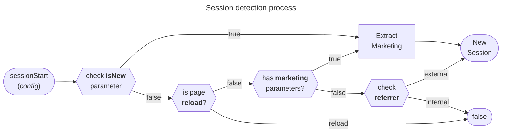

import Link from '@docusaurus/Link';

# Session

There are multiple ways about how to define and measure a session. Sessions
represent a period when a user is actively engaged with a website, often used
for attribution and conversion tracking. Different tools may define and detect
sessions in varying ways.

The `sessionStart` util helps to detect a new session indipendently, and can be
used to trigger a custom event. It works client-side and is cookieless by
default. If a new session is detected, it returns the sessions `data`, otherwise
`false`. There are `config` parameters to customize the session handling.

The function only checks for a new session and eventually returns the `data` for
a new one. An event has to be triggered manually:

```ts
const session = sessionStart();
if (session) elb('session start', session);
```

This might send a `session start` event with the following `data`:

```js
// Page https://www.elbwalker.com/docs/session?utm_campaign=docs

{
  id: 's3ss10n1d',
  marketing: true,
  campaign: 'docs',
}
```

## Detection process

Basic rules to detect a new session:

0. **Storage Check** (_Optional_): First, check for an existing sessionId in
   storage. If none is found, consider it a new session. This usually requires
   consent.
1. **Page reload**: If the entry type is a page reload, it's not a new session.
2. **Marketing Parameters**: The presence of marketing parameters in the URL
   indicates a new session.
3. **Referrer Check**: A different referrer from the current domain signals a
   new session.



:::note

Be aware of potential multiple unintended events for the same user due to
referrer hiding. For more details, learn about
[Referrer Hiding](https://en.wikipedia.org/wiki/HTTP_referer#Referrer_hiding).

:::

## Config parameters

The `sessionStart` function is designed to work out of the box but offers
optional `config` parameters for customization:

```ts
interface SessionStart {
  data?: Walker.Properties;
  domains?: string[];
  isNew?: boolean;
  parameters?: MarketingParameters;
  referrer?: string;
  url?: string;
}

interface MarketingParameters {
  [key: string]: string;
}
```

### Custom Data

Enhance the default `data` properties with custom information, like a session
count:

```js
const count = 2;
const session = sessionStart({ data: { count } });
```

This will return a `data` object like `{ id: "r4nd0m", count: 2 }`.

### Internal Domains

Define internal domains to prevent new sessions from triggering when navigating
between them:

```js
const session = sessionStart({
  domains: ['subdomain.elbwalker.com', 'example.com'],
});
```

A user coming from `subdomain.elbwalker.com` or `example.com` to e.b.
`www.elbwalker.com`, will no longer trigger a new session.

### Manual New Session Controll

Determine if it's a new session using the `isNew` parameter. This might require
consent for storage access and therefore isn't impletement by default.

Usually, the `sessionId` written to the storage is set up to expire and should
be updated with each page view. If the `sessionId` is missing, it's maybe an
expired but at least a new session.

```js
if (!storageRead('sessionId')) {
  const session = sessionStart({ isNew: true });
  storageWrite('sessionId', session.id);
}
```

> For more information on stoage and expiration, see <Link to="storage">
> Utils/Storage </Link>

### Marketing Parameters

The helper util <Link to="helper#getmarketingparameters">
getMarketingParameters</Link> is used to extract common parameters like all
`utm variants`, typical clickIds like `fbclid`, `gclid`, and others.

To enhance the default and support custom ones add `parameters`, like
`{ elb_campaign: 'campaign' }` to add `campaign: "docs"` to `data` for a url
with `?elb_campaign=docs`.

A session with marketing parameter will be flagged with `data.marketing = true`
automatically.

```js
const session = sessionStart({
  parameters: { elb_campaign: 'docs' },
});
```

### Referrer Customization

By default the `document.referrer` is used, but it can be overwritten with the
`referrer` parameter.

```js
const session = sessionStart({ referrer: 'https://example.com' });
```

domains can be extended, e.g. internal sub-domains. `Data` can be pre-defined,
e.g. to use your own id.

### URL Customization

By default the `window.location.href` is used, but it can be overwritten with
the `url` parameter.

```js
const session = sessionStart({ url: 'https://example.com' });
```
