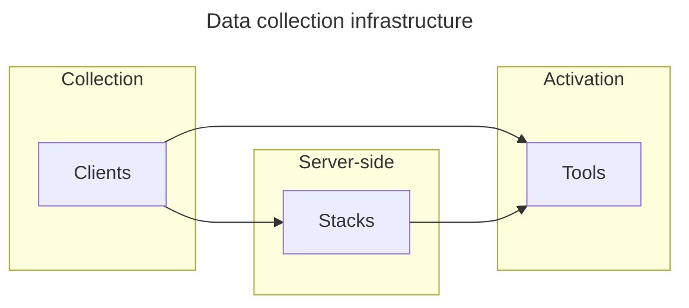

# walkerOS

Every business is individual, and so are their data needs. Standard setups are
for average companies running into common problems. Designed as a unified,
reliable, and privacy-centric data collection platform, walkerOS functions as a
single source of truth for data needs and integrates seamlessly with various
tools for data analysis or storage. Bringing together various roles like data
engineers, product owners, analysts, marketers, and developers with their
individual requirements.

Key features include data quality enforcement, built-in consent management, data
redaction capabilities, first-party data collection, and support for server-side
and client-side event tracking.

It's tailored for enterprises, agencies, freelancers, and anyone involved in
data-driven decision-making. Its flexibility allows quick results without
disrupting existing setups.

## Why walkerOS?

- **Reliability**: A dependable infrastructure for continuous data collection,
  even amidst evolving data landscapes.
- **Privacy Focus**: Emphasizing user privacy, with a strict privacy-by-design
  approach ,in-build consent management and various data protection features.
- **Complete Data Ownership**: Gain full control with your first-party data,
  avoid vendor lock-in and control data processing.
- **Flexible Architecture**: Adapt walkerOS to your specific data needs with the
  modular design and grow step-by-step.
- **Simplified Data Model**: The intuitive event model streamlines data
  collection, making analytics straightforward and efficient.

## How walkerOS operates

walkerOS functions through a streamlined framework:

- **Clients**: Manage data creation and state with ease.
- **Stacks**: Robust server-side processing and data integrity checks.
- **Tools**: Third-party vendors for effective data activation and analysis.
- **Destinations**: The connection in-between to integrate various data
  components.
- **Utils**: Little helpers to enhance data collection and processing.

Discover and enable the full potential of your data setp-by-step with walkerOS.
