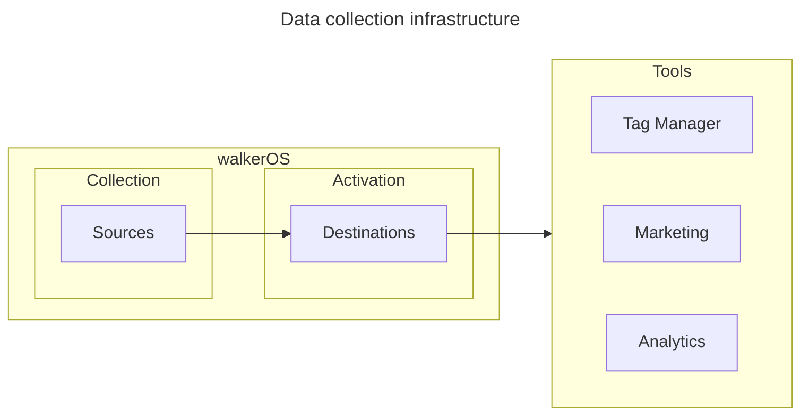
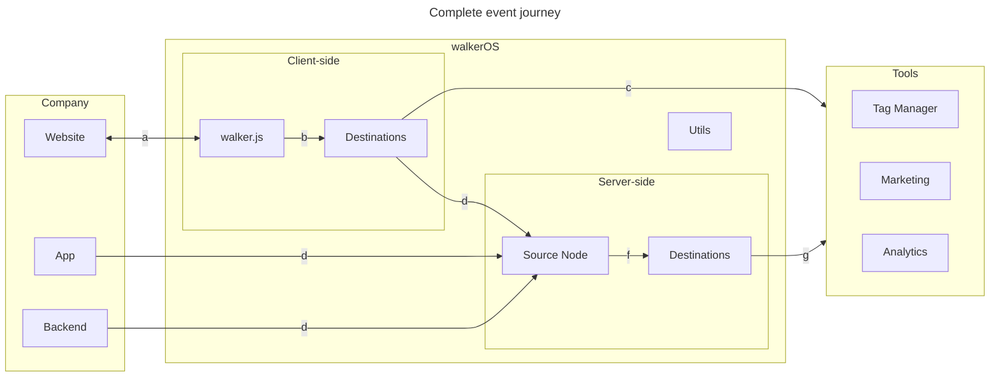

import Link from '@docusaurus/Link';

# walkerOS

Every business is **individual**, and so are their **data needs**. Data
foundations grow and adapt to those needs over time. Evolving requirements often
result in tremendous communication and implementation effort, (accidental) user
privacy violations, and a growing dependence on a single analytics provider.

Designed as a **unified and privacy-centric data collection platform**, walkerOS
creates the **single source of truth** for data teams.

It seamlessly integrates with **various tools** for analysis and marketing,
bringing together **various roles** like Data Engineers, Analysts, Product
Owners, Growth Marketers, and Developers with their individual needs.

Key features include **data quality** enforcement, built-in **consent
management**, **data redaction** capabilities, **first-party** data collection,
and support for server-side and client-side event tracking.

It's tailored for **enterprises, agencies, freelancers, and anyone involved in
data-driven decision-making**. Its flexibility allows **quick results** without
disrupting existing setups.

## Why walkerOS?

- **Reliability**: A dependable infrastructure for continuous data collection,
  even amidst evolving data landscapes.
- **Privacy Focus**: Emphasizing user privacy, with a strict privacy-by-design
  approach, in-build consent management and various data protection features.
- **Complete Data Ownership**: Gain full control with your first-party data,
  avoid vendor lock-in and control data processing.
- **Flexible Architecture**: Adapt walkerOS to your specific data needs with the
  modular design and grow step-by-step.
- **Simplified Data Model**: The intuitive event model streamlines data
  collection, making analytics straightforward and efficient.

## How walkerOS operates

walkerOS functions through a streamlined framework with one
standardized&nbsp;<Link to="/docs/walkeros/event-model">Event model</Link>.
Components are designed to always be extensible for a steadily growing data
journey.

- <Link to="sources">**Sources**</Link>: Collecting events, state management and
  complete control of data collection.
- <Link to="destinations">**Destinations**</Link>: Activating data by
  initializing, mapping and finally sharing events to third-party tools.
- <Link to="utils">**Utils**</Link>: Supporting helper function to standardize
  and improve data collection.

<Link to="/docs/walkeros/getting-started">**Get started**</Link> with walkerOS step-by-step
to enable the full potential of your data.

## Complete infrastructure

A complete event journey is something that grows steadily. It's not created by
one large project. Step-by-step, the infrastructure evolves, additional events
get triggered, new destinations are added, and configurations are updated.

- **a**: The&nbsp;<Link to="/docs/sources/walkerjs/">walker.js</Link> integrates
  with the
  website,&nbsp;<Link to="/docs/sources/walkerjs/commands#initialization">initializes</Link>
  event listeners and interprets
  the&nbsp;<Link to="/docs/sources/walkerjs/tagging">tagging</Link> on the page.
- **b**: Ensures a
  user&nbsp;<Link to="/docs/sources/walkerjs/commands#consent-management">granted
  consent</Link>,
  eventually&nbsp;<Link to="/docs/destinations/#init">initializes</Link> and
  &nbsp;<Link to="/docs/destinations/#mapping">maps</Link>
  events&nbsp;<Link to="/docs/destinations/#configuration">appropriately</Link>
  before&nbsp;<Link to="/docs/destinations/#push">pushing</Link> them
  to&nbsp;<Link to="/docs/destinations/web/">destinations</Link>.
- **c**: Events
  are&nbsp;<Link to="/docs/destinations/web/#create-your-own">formatted
  correctly</Link> and get sent directly to the respective tools from the
  source.

### Server-side setups

- **d**: Events can be sent to a (public) endpoint from various sources, running
  a&nbsp;<Link to="/docs/sources/node/">Source Node</Link>
- **f**: Similar to client-side operations, consent gets verified, a
  &nbsp;<Link to="/docs/destinations/node/">destination</Link>
  eventually&nbsp;<Link to="/docs/destinations/node/#init">initialized</Link>,
  and
  event&nbsp;<Link to="/docs/destinations/node/#custom-configuration">preparation</Link>
  are processed server-side.
- **g**: Events are formatted correctly and sent to tools from the server.
