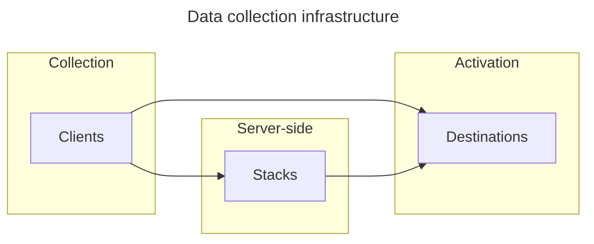

import Link from '@docusaurus/Link';

# walkerOS

Every business is individual, and so are their data needs. Data foundations grow
and adapt to those needs over time. Evolving requirements often result in
tremendous communication and implementation effort, (accidental) user privacy
violations, and a growing dependence on a single analytics provider.

Designed as a unified and privacy-centric data collection platform, walkerOS
creates the single source of truth for data teams.

It seamlessly integrates with various analysis and storage tools, bringing
together various roles like Data Engineers, Analysts, Product Owners, Growth
Marketers, and Developers with their individual needs.

Key features include data quality enforcement, built-in consent management, data
redaction capabilities, first-party data collection, and support for server-side
and client-side event tracking.

It's tailored for enterprises, agencies, freelancers, and anyone involved in
data-driven decision-making. Its flexibility allows quick results without
disrupting existing setups.

## Why walkerOS?

- **Reliability**: A dependable infrastructure for continuous data collection,
  even amidst evolving data landscapes.
- **Privacy Focus**: Emphasizing user privacy, with a strict privacy-by-design
  approach ,in-build consent management and various data protection features.
- **Complete Data Ownership**: Gain full control with your first-party data,
  avoid vendor lock-in and control data processing.
- **Flexible Architecture**: Adapt walkerOS to your specific data needs with the
  modular design and grow step-by-step.
- **Simplified Data Model**: The intuitive event model streamlines data
  collection, making analytics straightforward and efficient.

## How walkerOS operates

walkerOS functions through a streamlined framework with one standardized event
message.

- <Link to="clients">**Clients**</Link>: Manage data creation and state with
  ease.
- <Link to="stacks">**Stacks**</Link>: Server-side processing and data integrity
  checks.
- <Link to="destinations">**Destinations**</Link>: Third-party vendors for
  effective data activation and analysis.
- <Link to="utils">**Utils**</Link>: Little helpers to enhance data collection
  and processing.

Discover and enable the full potential of your data setp-by-step with walkerOS.
